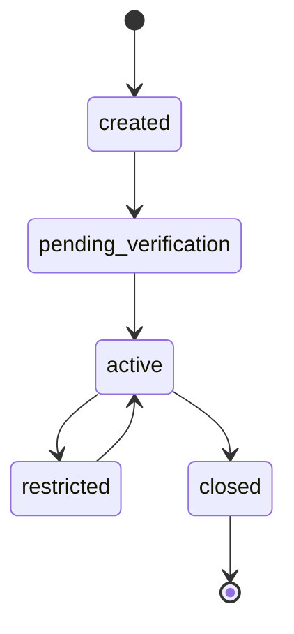
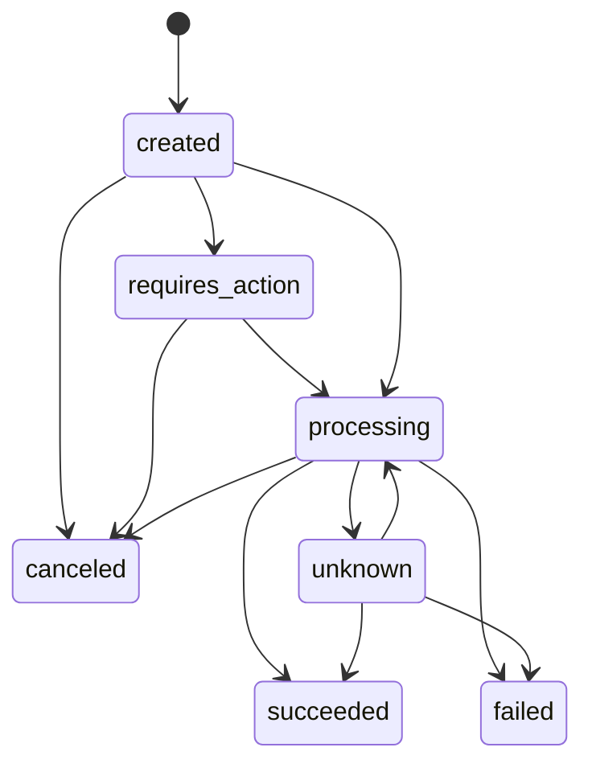
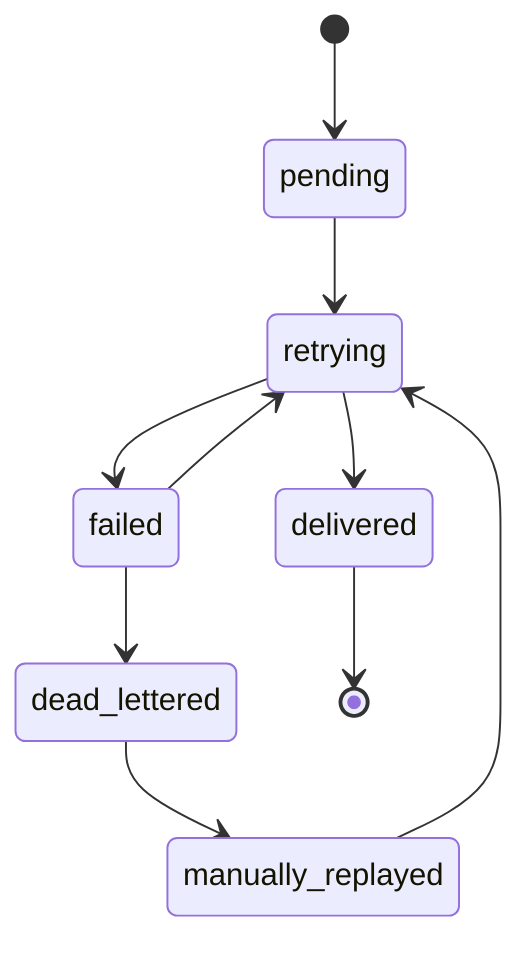
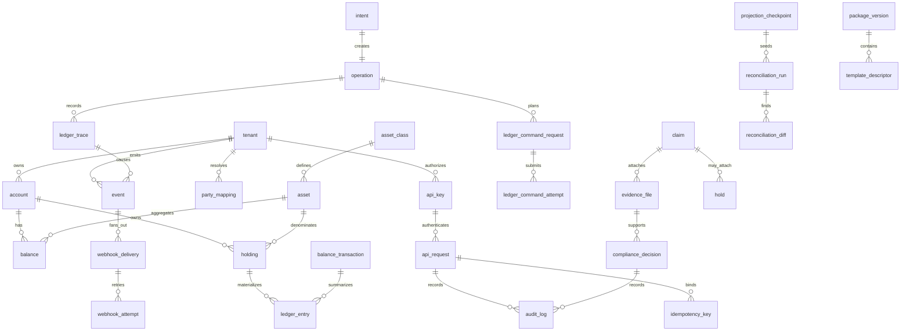

# Pillar Data Model

This atlas is the canonical Dev data-model reference for public objects, internal entities, Daml templates, and Postgres tables. It consolidates the object grammar from [Architecture/04](../Architecture/04_Object%20Model.md), the read-model rules from [Architecture/05](../Architecture/05_asset%20read%20model.md), intent lifecycle rules from [Architecture/06](../Architecture/06_TransferIntent_SettlementIntent%20State%20Machine.md), the Daml catalog from [Architecture/08](../Architecture/08_Daml%20Template%20Library.md), audit trace rules from [Architecture/11](../Architecture/11.Request%20Logs%20Ledger%20Trace%20Audit.md), and DB schema from [Architecture/23](../Architecture/23_Implementation%20Plan.md).

## 1. Three planes

| Plane   | Name               | Canonical contents                                                                | Authority                                      | Public exposure                     |
| ------- | ------------------ | --------------------------------------------------------------------------------- | ---------------------------------------------- | ----------------------------------- |
| Plane A | Canton Ledger      | Daml templates, active contract set, command completions, updates, ledger offsets | Economic source of truth                       | Never raw by default                |
| Plane B | Pillar Postgres    | Projection, Audit, Config, webhook delivery, reconciliation checkpoints           | Serving cache and durable operational evidence | Only rendered through `/v1` objects |
| Plane C | Public API objects | polished objects returned by `/v1`, SDKs, CLI, Workbench, webhooks            | Contracted customer grammar                    | Public, Canton-invisible            |

Rules:

1. Plane A decides ownership, balances, holds, transfers, settlement, redemption, reversal, and claim state.
2. Plane B never becomes an economic ledger. Projection rows are rebuildable from Plane A; audit/config rows support API stability and operations.
3. Plane C never exposes `contractId`, `templateId`, `partyId`, `participantId`, `packageId`, `commandId`, `submissionId`, or raw ledger offsets except via role-gated trace/debug surfaces.
4. Every mutation is traceable as `api_request -> idempotency_key -> intent -> operation -> ledger_command_request -> ledger_command_attempt -> ledger update -> projection -> event -> webhook_delivery`.
5. Tenant isolation is present in all three planes: Daml `tenantId`/party visibility, Postgres `tenant_id` or `environment_id`, and API key/environment scoping.

## 2. Cross-plane mapping table

| Public API object        | Projection table                                    | Audit/config table                                       | Daml template or ledger source                         | Owner phase |
| ------------------------ | --------------------------------------------------- | -------------------------------------------------------- | ------------------------------------------------------ | ----------- |
| `organization`           | -                                                   | `organizations`                                          | off-ledger config                                      | P2/P3       |
| `project`                | -                                                   | `projects`                                               | off-ledger config                                      | P2/P3       |
| `environment`            | -                                                   | `environments`                                           | participant/package topology config                    | P2/P3/P9    |
| `account`                | `accounts_projection` or `accounts` read view       | `accounts`, `party_mappings`                             | `AccountRef` / `Account` / identity binding            | P1/P2/P5    |
| `capability`             | embedded in `accounts_projection.requirements_json` | `party_mappings.rights_json`, `api_keys.scopes`          | `Account` capability fields                            | P2/P8       |
| `participant`            | -                                                   | `participants`                                           | Canton participant route                               | P3/P9       |
| `party_mapping`          | -                                                   | `party_mappings`                                         | party allocation / rights, encrypted internally        | P3/P4/P8    |
| `asset_class`            | `asset_classes_projection`                          | `asset_configs` / template registry config               | `AssetRules` / `AssetDefinition`                       | P1/P2/P5    |
| `asset`                  | `assets_projection`                                 | `asset_configs`                                          | `AssetRules` / `AssetDefinition`                       | P1/P2/P5    |
| `holding`                | `holdings_projection` / `holdings`                  | `ledger_traces`                                          | `Holding` active contracts                             | P1/P5       |
| `balance`                | `balances_projection` / `balances`                  | `projection_checkpoints`                                 | aggregate of `Holding` minus `Hold`/locks              | P5          |
| `balance_transaction`    | `balance_transactions`                              | `ledger_traces`                                          | normalized ledger update entries                       | P5          |
| `ledger_entry`           | `ledger_entries`                                    | `ledger_traces`                                          | create/exercise/archive events normalized              | P5/P8       |
| `issue_intent`           | `intents` / issue projection                        | `intents`, `operations`, `ledger_command_requests`       | `IssueIntent`                                          | P4          |
| `redeem_intent`          | `redemptions_projection`                            | `intents`, `operations`, `ledger_command_requests`       | `RedeemIntent` / `RedemptionIntent`                    | P4/P5       |
| `transfer_intent`        | `transfer_intents_projection`                       | `intents`, `operations`, `ledger_command_requests`       | `TransferIntent`                                       | P4/P5       |
| `transfer`               | `transfers_projection`                              | `operations`, `ledger_traces`                            | `Holding.TransferOut` / transfer execution             | P4/P5       |
| `settlement_intent`      | `settlement_intents_projection`                     | `intents`, `operations`, `ledger_command_requests`       | `SettlementIntent`                                     | P4/P5       |
| `settlement`             | `settlements_projection`                            | `operations`, `ledger_traces`                            | settlement execution choices                           | P4/P5       |
| `hold` / `lock`          | `locks_projection` / `holds`                        | `operations`, `ledger_traces`                            | `Hold` / `HoldingLock`                                 | P4/P5       |
| `reversal`               | `reversals_projection`                              | `intents`, `operations`, `ledger_command_requests`       | `ReversalIntent` / compensating command                | P4/P5       |
| `claim`                  | `claims_projection`                                 | `evidence_files`, `compliance_decisions`, `audit_log`    | `Claim` + optional `Hold` attachment                   | P8/P5       |
| `event`                  | `event_log` / `events`                              | `api_requests`, `ledger_traces`                          | projected ledger state transition                      | P6          |
| `webhook_endpoint`       | -                                                   | `webhook_endpoints`                                      | off-ledger delivery config                             | P6/P8       |
| `webhook_delivery`       | `webhook_deliveries`                                | `webhook_attempts` / `webhook_delivery_attempts`         | off-ledger delivery state                              | P6          |
| `request_log`            | -                                                   | `api_requests` / `request_logs`                          | HTTP request evidence                                  | P3/P8       |
| `ledger_trace`           | -                                                   | `ledger_traces`, `operations`, `ledger_command_attempts` | command completion/update identifiers                  | P4/P8       |
| `operation`              | `operation_projection`                              | `operations`                                             | `OperationTrace` / command metadata                    | P3/P4       |
| `template`               | -                                                   | `template_descriptors`, `package_versions`, `templates`  | DAR/package/template metadata                          | P12         |
| `file` / `evidence_file` | -                                                   | `files`, `evidence_files`                                | hash/reference only, optionally `Claim`/audit observer | P8          |
| `test_clock`             | -                                                   | `test_clocks`                                            | sandbox time control; no production ledger authority   | P7/P10      |
| `api_key`                | -                                                   | `api_keys`, `audit_log`                                  | auth config only                                       | P8          |
| `usage_event`            | -                                                   | `usage_events`                                           | billing/metering fact derived from API/runtime events  | P14         |

## 3. ID grammar registry

| Prefix                    | Object / entity           | Owning plane | Generator                                    | Persistence rule                                                | Public exposure                                        |
| ------------------------- | ------------------------- | ------------ | -------------------------------------------- | --------------------------------------------------------------- | ------------------------------------------------------ |
| `org_`                    | organization              | B/C          | config service                               | stable config row, soft-delete                                  | public admin                                           |
| `proj_`                   | project                   | B/C          | config service                               | stable config row, soft-delete                                  | public admin                                           |
| `env_`                    | environment               | B/C          | config service                               | stable config row                                               | public admin                                           |
| `acct_`                   | account                   | A/B/C        | API/config creates, ledger validates binding | stable; status changes only                                     | public                                                 |
| `cap_`                    | capability                | B/C          | API/config                                   | derived or config; no economic authority                        | public embedded/optional                               |
| `ptcp_`                   | participant               | B            | deployment registry                          | config row, rotated by deployment                               | admin/support only                                     |
| `pm_`                     | party_mapping             | B            | party-mapping service                        | config row with encrypted party reference                       | not public by default                                  |
| `acls_`                   | asset_class               | A/B/C        | asset service                                | ledger-backed projection + config                               | public                                                 |
| `ast_` / `asset_`         | asset                     | A/B/C        | asset service                                | ledger-backed projection + config                               | public; prefer `ast_` in Dev contract                  |
| `hld_`                    | holding                   | A/B/C        | projection/runtime                           | stable public holding abstraction across contract fragmentation | public                                                 |
| `bal_`                    | balance                   | B/C          | projection worker                            | deterministic `tenant + account + asset` projection             | public                                                 |
| `btxn_`                   | balance_transaction       | B/C          | projection worker                            | append-only projection/audit fact                               | public                                                 |
| `le_`                     | ledger_entry              | B            | projection worker                            | append-only normalized ledger fact                              | role-gated                                             |
| `issint_`                 | issue_intent              | A/B/C        | intent service                               | stable intent row/template                                      | public                                                 |
| `redint_` / `rdm_`        | redeem/redemption intent  | A/B/C        | intent service                               | stable intent row/template                                      | public; prefer `redint_` in Dev regression contract    |
| `trint_` / `ti_` / `trn_` | transfer_intent           | A/B/C        | intent service                               | stable intent row/template                                      | public; prefer `trint_` in Dev regression contract     |
| `tr_`                     | transfer                  | A/B/C        | projection worker                            | created when transfer execution is observed                     | public                                                 |
| `si_` / `stl_`            | settlement_intent         | A/B/C        | intent service                               | stable intent row/template                                      | public; prefer `si_` for intent, `set_` for settlement |
| `set_`                    | settlement                | A/B/C        | projection worker                            | created when settlement execution is observed                   | public                                                 |
| `hold_` / `lock_`         | hold / lock               | A/B/C        | hold service / projection worker             | ledger-backed active/terminal lock                              | public                                                 |
| `rev_`                    | reversal                  | A/B/C        | intent service                               | append compensating workflow; never rewrites source             | public                                                 |
| `clm_`                    | claim                     | A/B/C        | claim/compliance service                     | ledger-backed claim projection with evidence refs               | public or compliance-scoped                            |
| `evt_`                    | event                     | B/C          | event projector                              | immutable append-only event snapshot                            | public                                                 |
| `we_`                     | webhook_endpoint          | B/C          | webhook config service                       | config row, secret hidden after create/rotate                   | public admin                                           |
| `wd_`                     | webhook_delivery          | B/C          | webhook dispatcher                           | append/update delivery status; attempts append-only             | public/admin                                           |
| `req_`                    | request_log / api_request | B/C          | API gateway                                  | append-only masked request/response evidence                    | public/support                                         |
| `lt_` / `ltr_`            | ledger_trace              | A/B/C        | command runtime                              | durable trace row; Canton IDs role-gated                        | role-gated                                             |
| `op_`                     | operation                 | B/C          | idempotency/operation service                | deterministic for same tenant+endpoint+key+hash                 | public-safe                                            |
| `lcr_`                    | ledger_command_request    | B            | ledger-command service                       | append/update status, one or more per operation                 | internal                                               |
| `lca_`                    | ledger_command_attempt    | B            | ledger-command service                       | append-only per submission attempt                              | internal/support                                       |
| `tpl_`                    | template descriptor       | B/C          | template registry                            | versioned config row                                            | public/admin                                           |
| `pkg_`                    | package version           | B            | template registry                            | immutable package metadata row                                  | admin/support                                          |
| `file_`                   | file / evidence_file      | B/C          | file service                                 | immutable blob metadata; content external/encrypted             | public/compliance-scoped                               |
| `clock_`                  | test_clock                | B/C          | sandbox service                              | mutable sandbox config, never live economic state               | sandbox public                                         |
| `ak_`                     | api_key object            | B/C          | security service                             | hashed secret only; reveal secret once                          | public admin                                           |
| `aud_`                    | audit_log                 | B/C          | audit service                                | append-only/WORM                                                | admin/compliance                                       |
| `cd_`                     | compliance_decision       | B/C          | compliance adapter                           | append-only decision fact                                       | compliance-scoped                                      |
| `ue_`                     | usage_event               | B            | usage meter                                  | append-only metering fact                                       | admin/billing                                          |
| `rrun_`                   | reconciliation_run        | B            | reconciler                                   | append-only run record with status updates                      | admin                                                  |
| `rdiff_`                  | reconciliation_diff       | B            | reconciler                                   | append-only diff; never silent correction                       | admin                                                  |

## 4. Public objects

All public objects include common fields unless explicitly impossible for a config/action result: `id` string required public, `object` enum required public, `created` timestamp required public, `livemode` boolean required public, `metadata` object required public, and `updated` timestamp when mutable. Expand options are explicit and never expose Canton raw identifiers in customer contexts.

### 4.1 Field catalog

| Object                   | Field                                                                                                                                                                                      | Type                      | Required   | Public               | Expandable                                                                        |
| ------------------------ | ------------------------------------------------------------------------------------------------------------------------------------------------------------------------------------------ | ------------------------- | ---------- | -------------------- | --------------------------------------------------------------------------------- | --- | --- |
| `organization`           | `id`, `object`, `created`, `updated`, `livemode`, `metadata`                                                                                                                               | common                    | yes        | yes                  | no                                                                                |
| `organization`           | `status`                                                                                                                                                                                   | enum `active              | restricted | closed`              | yes                                                                               | yes | no  |
| `organization`           | `name`, `legal_name`, `country`, `default_currency`                                                                                                                                        | string                    | mixed      | yes                  | no                                                                                |
| `organization`           | `settings`, `compliance_profile`                                                                                                                                                           | object                    | yes        | admin                | no                                                                                |
| `project`                | `id`, `object`, `created`, `updated`, `livemode`, `metadata`                                                                                                                               | common                    | yes        | yes                  | no                                                                                |
| `project`                | `organization`, `status`, `name`, `default_api_version`                                                                                                                                    | id/string/enum            | yes        | yes                  | `organization`                                                                    |
| `environment`            | `id`, `object`, `created`, `updated`, `livemode`, `metadata`                                                                                                                               | common                    | yes        | yes                  | no                                                                                |
| `environment`            | `project`, `mode`, `deploymentMode`, `status`, `api_version_default`                                                                                                                       | id/enum/string            | yes        | yes                  | `project`                                                                         |
| `account`                | `id`, `object`, `created`, `updated`, `livemode`, `metadata`                                                                                                                               | common                    | yes        | yes                  | no                                                                                |
| `account`                | `type`, `status`, `capabilities`, `requirements`, `default_asset_policy`                                                                                                                   | enum/object               | yes        | yes                  | no                                                                                |
| `account`                | `identity`, `balance`, `party_mapping`                                                                                                                                                     | id/object                 | no         | mixed                | `identity`, `balance`; `party_mapping` admin only                                 |
| `capability`             | `id`, `object`, `created`, `livemode`, `metadata`                                                                                                                                          | common                    | yes        | yes                  | no                                                                                |
| `capability`             | `account`, `name`, `status`, `requirements`, `disabled_reason`                                                                                                                             | id/string/enum/object     | yes        | yes                  | `account`                                                                         |
| `participant`            | `id`, `object`, `created`, `updated`, `livemode`, `metadata`                                                                                                                               | common                    | yes        | admin                | no                                                                                |
| `participant`            | `environment`, `status`, `deploymentMode`, `health`, `package_status`                                                                                                                      | id/enum/object            | yes        | admin                | `environment`                                                                     |
| `party_mapping`          | `id`, `object`, `created`, `updated`, `livemode`, `metadata`                                                                                                                               | common                    | yes        | support              | no                                                                                |
| `party_mapping`          | `account`, `participant`, `status`, `rights`, `external_signing`                                                                                                                           | id/enum/object            | yes        | support              | `account`, `participant`                                                          |
| `asset_class`            | `id`, `object`, `created`, `updated`, `livemode`, `metadata`                                                                                                                               | common                    | yes        | yes                  | no                                                                                |
| `asset_class`            | `issuer`, `kind`, `code`, `symbol`, `scale`, `status`                                                                                                                                      | id/string/int/enum        | yes        | yes                  | `issuer`                                                                          |
| `asset_class`            | `settlement_policy`, `transfer_restrictions`                                                                                                                                               | object                    | yes        | yes                  | no                                                                                |
| `asset`                  | `id`, `object`, `created`, `updated`, `livemode`, `metadata`                                                                                                                               | common                    | yes        | yes                  | no                                                                                |
| `asset`                  | `asset_class`, `issuer`, `status`, `quantity_issued`, `quantity_outstanding`, `terms`                                                                                                      | id/enum/decimal/object    | yes        | yes                  | `asset_class`, `issuer`                                                           |
| `holding`                | `id`, `object`, `created`, `updated`, `livemode`, `metadata`                                                                                                                               | common                    | yes        | yes                  | no                                                                                |
| `holding`                | `account`, `asset`, `asset_class`, `quantity_total`, `quantity_available`, `quantity_locked`, `quantity_pending`, `status`                                                                 | id/decimal/enum           | yes        | yes                  | `account`, `asset`                                                                |
| `holding`                | `source_intent`, `restrictions`, `ledger_trace`                                                                                                                                            | id/array/string           | no         | mixed                | `source_intent`, `ledger_trace` role-gated                                        |
| `balance`                | `id`, `object`, `created`, `updated`, `livemode`, `metadata`                                                                                                                               | common                    | yes        | yes                  | no                                                                                |
| `balance`                | `account`, `asset`, `available`, `pending`, `locked`, `reserved`, `settled`, `as_of_ledger_time`                                                                                           | id/decimal/timestamp      | yes        | yes                  | `account`, `asset`                                                                |
| `balance`                | `as_of_ledger_offset`, `projection_status`                                                                                                                                                 | string/enum               | yes        | public-safe          | no                                                                                |
| `balance_transaction`    | `id`, `object`, `created`, `livemode`, `metadata`                                                                                                                                          | common                    | yes        | yes                  | no                                                                                |
| `balance_transaction`    | `account`, `asset`, `asset_class`, `amount`, `direction`, `type`, `source`, `status`, `available_on`                                                                                       | id/decimal/enum/timestamp | yes        | yes                  | `account`, `asset`, `source`                                                      |
| `balance_transaction`    | `ledger_entries`, `ledger_trace`                                                                                                                                                           | array/id                  | no         | role-gated           | `ledger_entries`, `ledger_trace`                                                  |
| `ledger_entry`           | `id`, `object`, `created`, `livemode`, `metadata`                                                                                                                                          | common                    | yes        | role-gated           | no                                                                                |
| `ledger_entry`           | `balance_transaction`, `account`, `asset`, `debit`, `credit`, `entry_type`, `status`, `posted_at`                                                                                          | id/decimal/enum/timestamp | yes        | role-gated           | `balance_transaction`                                                             |
| `issue_intent`           | `id`, `object`, `created`, `updated`, `livemode`, `metadata`                                                                                                                               | common                    | yes        | yes                  | no                                                                                |
| `issue_intent`           | `asset`, `destination_account`, `amount`, `status`, `next_action`, `failure_code`, `operation`                                                                                             | id/decimal/enum/object    | yes        | yes                  | `asset`, `destination_account`, `operation`                                       |
| `redeem_intent`          | `id`, `object`, `created`, `updated`, `livemode`, `metadata`                                                                                                                               | common                    | yes        | yes                  | no                                                                                |
| `redeem_intent`          | `account`, `asset`, `amount`, `destination`, `status`, `lock`, `files`, `next_action`, `failure_code`, `operation`                                                                         | mixed                     | yes        | yes                  | `account`, `asset`, `lock`, `files`, `operation`                                  |
| `transfer_intent`        | `id`, `object`, `created`, `updated`, `livemode`, `metadata`                                                                                                                               | common                    | yes        | yes                  | no                                                                                |
| `transfer_intent`        | `source_account`, `destination_account`, `asset`, `amount`, `status`, `confirmation_method`, `lock_behavior`, `lock`, `transfer`, `expires_at`, `failure_code`, `next_action`, `operation` | mixed                     | yes        | yes                  | `source_account`, `destination_account`, `asset`, `lock`, `transfer`, `operation` |
| `transfer`               | `id`, `object`, `created`, `updated`, `livemode`, `metadata`                                                                                                                               | common                    | yes        | yes                  | no                                                                                |
| `transfer`               | `transfer_intent`, `source_account`, `destination_account`, `asset`, `amount`, `status`, `balance_transactions`, `operation`                                                               | mixed                     | yes        | yes                  | `transfer_intent`, `balance_transactions`, `operation`                            |
| `settlement_intent`      | `id`, `object`, `created`, `updated`, `livemode`, `metadata`                                                                                                                               | common                    | yes        | yes                  | no                                                                                |
| `settlement_intent`      | `mode`, `status`, `lock_policy`, `legs`, `participants`, `locks`, `settlement`, `expires_at`, `failure_code`, `next_action`, `operation`                                                   | mixed                     | yes        | yes                  | `locks`, `settlement`, `operation`                                                |
| `settlement`             | `id`, `object`, `created`, `updated`, `livemode`, `metadata`                                                                                                                               | common                    | yes        | yes                  | no                                                                                |
| `settlement`             | `settlement_intent`, `mode`, `status`, `legs`, `transfers`, `balance_transactions`, `operation`                                                                                            | mixed                     | yes        | yes                  | `settlement_intent`, `transfers`, `balance_transactions`, `operation`             |
| `hold` / `lock`          | `id`, `object`, `created`, `updated`, `livemode`, `metadata`                                                                                                                               | common                    | yes        | yes                  | no                                                                                |
| `hold` / `lock`          | `account`, `asset`, `amount`, `reason`, `source`, `status`, `expires_at`, `claim`, `operation`                                                                                             | mixed                     | yes        | yes                  | `account`, `asset`, `source`, `claim`, `operation`                                |
| `reversal`               | `id`, `object`, `created`, `updated`, `livemode`, `metadata`                                                                                                                               | common                    | yes        | yes                  | no                                                                                |
| `reversal`               | `source_type`, `source`, `asset`, `amount`, `reason`, `status`, `compensating_transfer`, `balance_transactions`, `operation`                                                               | mixed                     | yes        | yes                  | `source`, `compensating_transfer`, `balance_transactions`, `operation`            |
| `claim`                  | `id`, `object`, `created`, `updated`, `livemode`, `metadata`                                                                                                                               | common                    | yes        | scoped               | no                                                                                |
| `claim`                  | `claim_type`, `claimant_account`, `respondent_account`, `asset`, `amount`, `status`, `evidence_files`, `resolution`, `due_at`, `operation`                                                 | mixed                     | yes        | scoped               | `claimant_account`, `respondent_account`, `asset`, `evidence_files`, `operation`  |
| `event`                  | `id`, `object`, `created`, `livemode`                                                                                                                                                      | common                    | yes        | yes                  | no                                                                                |
| `event`                  | `type`, `api_version`, `data.object`, `previous_attributes`, `request`, `pending_webhooks`                                                                                                 | mixed                     | yes        | yes                  | `data.object`, `request`                                                          |
| `webhook_endpoint`       | `id`, `object`, `created`, `updated`, `livemode`, `metadata`                                                                                                                               | common                    | yes        | admin                | no                                                                                |
| `webhook_endpoint`       | `url`, `status`, `enabled_events`, `api_version`, `secret_preview`                                                                                                                         | mixed                     | yes        | admin                | no                                                                                |
| `webhook_delivery`       | `id`, `object`, `created`, `updated`, `livemode`, `metadata`                                                                                                                               | common                    | yes        | admin                | no                                                                                |
| `webhook_delivery`       | `event`, `endpoint`, `status`, `attempt_count`, `last_status_code`, `last_error`, `next_attempt_at`, `delivered_at`, `attempts`                                                            | mixed                     | yes        | admin                | `event`, `endpoint`, `attempts`                                                   |
| `request_log`            | `id`, `object`, `created`, `livemode`                                                                                                                                                      | common                    | yes        | support              | no                                                                                |
| `request_log`            | `method`, `path`, `api_version`, `idempotency_key_preview`, `status`, `status_code`, `error`, `response_hash`, `latency_ms`, `source_ip`                                                   | mixed                     | yes        | support              | no                                                                                |
| `ledger_trace`           | `id`, `object`, `created`, `updated`, `livemode`                                                                                                                                           | common                    | yes        | role-gated           | no                                                                                |
| `ledger_trace`           | `request`, `operation`, `status`, `participant`, `completion_status`, `transaction`, `choice`, `template_refs`, `contract_refs`                                                            | mixed                     | yes        | role-gated           | `request`, `operation`; raw refs debug only                                       |
| `operation`              | `id`, `object`, `created`, `updated`, `livemode`, `metadata`                                                                                                                               | common                    | yes        | yes                  | no                                                                                |
| `operation`              | `intent`, `status`, `ledger_trace`, `failure_code`, `as_of_ledger_time`                                                                                                                    | mixed                     | yes        | yes                  | `intent`, `ledger_trace` role-gated                                               |
| `template`               | `id`, `object`, `created`, `updated`, `livemode`, `metadata`                                                                                                                               | common                    | yes        | admin/public catalog | no                                                                                |
| `template`               | `name`, `version`, `category`, `api_schema`, `choices`, `compatibility`, `package_version`                                                                                                 | mixed                     | yes        | admin/public catalog | `package_version`                                                                 |
| `file` / `evidence_file` | `id`, `object`, `created`, `livemode`, `metadata`                                                                                                                                          | common                    | yes        | scoped               | no                                                                                |
| `file` / `evidence_file` | `purpose`, `filename`, `content_type`, `size`, `sha256`, `status`, `expires_at`, `related_object`                                                                                          | mixed                     | yes        | scoped               | `related_object`                                                                  |
| `test_clock`             | `id`, `object`, `created`, `updated`, `livemode`, `metadata`                                                                                                                               | common                    | yes        | sandbox              | no                                                                                |
| `test_clock`             | `frozen_time`, `status`, `advances`, `environment`                                                                                                                                         | mixed                     | yes        | sandbox              | `environment`                                                                     |
| `api_key`                | `id`, `object`, `created`, `updated`, `livemode`, `metadata`                                                                                                                               | common                    | yes        | admin                | no                                                                                |
| `api_key`                | `name`, `prefix`, `last4`, `scopes`, `restricted_ips`, `expires_at`, `last_used_at`, `status`                                                                                              | mixed                     | yes        | admin                | no                                                                                |
| `audit_log`              | `id`, `object`, `created`, `livemode`                                                                                                                                                      | common                    | yes        | compliance/admin     | no                                                                                |
| `audit_log`              | `actor`, `action`, `resource_type`, `resource_id`, `policy`, `ledger_trace`, `request`                                                                                                     | mixed                     | yes        | compliance/admin     | `ledger_trace`, `request`                                                         |

### 4.2 Status and lifecycle diagrams

Applies to `account`, `organization`, and many config objects. `closed` is terminal except explicit `reopen` choices where architecture allows.

Applies to `issue_intent`, `transfer_intent`, `redeem_intent`, `settlement_intent`, `reversal`, and operation-backed workflow objects. Terminal states are `succeeded`, `failed`, and `canceled` unless a compensating object is created.

Applies to `webhook_delivery`. `event` itself is immutable after creation.

## 5. Internal entities (DB only)

| Entity / table                                   | Key                                                | Foreign keys                                                                                 | Lifecycle                                                                                    | Retention policy                                                             |
| ------------------------------------------------ | -------------------------------------------------- | -------------------------------------------------------------------------------------------- | -------------------------------------------------------------------------------------------- | ---------------------------------------------------------------------------- |
| `tenants`                                        | `id`                                               | -                                                                                            | config row; upsert for settings, soft-close not hard delete                                  | permanent while customer/account exists                                      |
| `organizations`                                  | `id`                                               | -                                                                                            | config row; soft-delete/close                                                                | permanent or regulatory retention                                            |
| `projects`                                       | `id`                                               | `organization_id -> organizations.id`                                                        | config row; soft-delete                                                                      | permanent with organization                                                  |
| `environments`                                   | `id`                                               | `project_id -> projects.id`                                                                  | config row; status transitions                                                               | permanent; sandbox may be archived                                           |
| `accounts`                                       | `id`                                               | `tenant_id -> tenants.id`                                                                    | config/projection hybrid; status update, no economic authority                               | permanent; closed retained                                                   |
| `asset_configs`                                  | `id`                                               | `tenant_id`, issuer account refs                                                             | config row; versioned expand-and-contract                                                    | permanent for issued assets                                                  |
| `api_keys`                                       | `id`                                               | `tenant_id`, optional `account_id`/`environment_id`                                          | config row; secret hash only; rotate/expire/revoke                                           | retain hash/audit after expiry per security policy                           |
| `api_versions`                                   | `(tenant_id, version)` or `id`                     | `tenant_id`                                                                                  | config row; append compatible versions                                                       | permanent compatibility history                                              |
| `webhook_endpoints`                              | `id`                                               | `tenant_id`/`environment_id`                                                                 | config row; enabled/disabled/rotated secret                                                  | retained after disable for event replay window                               |
| `party_mappings`                                 | `id` and unique `(tenant_id, account_id, purpose)` | `tenant_id`, `account_id`, `participant_id`                                                  | config row; rotate encrypted party binding; never expose raw party                           | permanent traceability; encrypted fields managed by KMS policy               |
| `api_requests` / `request_logs`                  | `id` / `request_id`                                | optional `api_key_id`, `tenant_id`                                                           | append-only after completion fields set                                                      | medium-term masked; hashes may be long-term                                  |
| `idempotency_keys` / `idempotency_records`       | `(tenant_id, key)` or `(environment_id, key)`      | `request_log_id`, optional `operation_id`                                                    | insert/lock/update cached response; expires                                                  | at least active idempotency window; GC after policy with audit hash retained |
| `intents`                                        | `id`                                               | `tenant_id`, `operation_id`                                                                  | insert then status update from runtime/projection                                            | retained for customer object history                                         |
| `operations`                                     | `id`                                               | `tenant_id`, `intent_id`, `trace_id`                                                         | deterministic insert per logical change; status update                                       | long-term operational evidence                                               |
| `ledger_command_requests`                        | `id`                                               | `tenant_id`, `operation_id`                                                                  | insert once command needed; status update until terminal                                     | long-term with operation                                                     |
| `ledger_command_attempts`                        | `id` or `(operation_id, submission_id)`            | `operation_id`, `ledger_command_request_id`                                                  | append-only per submission attempt                                                           | long-term evidence; no raw secrets                                           |
| `command_outbox`                                 | `id`                                               | `request_log_id`, `ledger_trace_id`                                                          | queued -> in-flight -> terminal; superseded by command request tables in implementation plan | retained or migrated into command request/attempt history                    |
| `ledger_traces`                                  | `id`                                               | `request_log_id`, `participant_id`                                                           | insert then enrich with completion/update/offset                                             | long-term compliance evidence; encrypted refs only                           |
| `audit_log` / `audit_logs`                       | `id`                                               | optional `request_id`, `ledger_trace_id`, resource ids                                       | append-only/WORM; hash chained                                                               | long-term/WORM per compliance                                                |
| `accounts_projection`                            | `id`                                               | `environment_id`, optional `party_mapping_id`                                                | upsert from ledger/projection; rebuildable                                                   | rebuildable; current plus snapshots if configured                            |
| `asset_classes_projection`                       | `id`                                               | `environment_id`, `issuer_account_id`                                                        | upsert from ledger/config projection                                                         | rebuildable; history from ledger/audit                                       |
| `assets_projection`                              | `id`                                               | `environment_id`, `asset_class_id`, `issuer_account_id`                                      | upsert from ledger                                                                           | rebuildable                                                                  |
| `holdings_projection` / `holdings`               | `id`                                               | `tenant_id/environment_id`, `account_id`, `asset_id`                                         | upsert/archive from ledger ACS/update stream                                                 | rebuildable; current projection can be replaced                              |
| `balances_projection` / `balances`               | `id`, unique `(tenant_id, account_id, asset_id)`   | `account_id`, `asset_id`                                                                     | deterministic upsert aggregate                                                               | rebuildable; no authority                                                    |
| `balance_transactions`                           | `id`                                               | `account_id`, `asset_id`, `trace_id`                                                         | append-only statement line                                                                   | long-term statement/audit retention                                          |
| `ledger_entries`                                 | `id`                                               | `balance_transaction_id`, `account_id`, `asset_id`, `trace_id`                               | append-only normalized ledger fact                                                           | long-term; internal by default                                               |
| `transfer_intents_projection`                    | `id`                                               | `source_account_id`, `destination_account_id`, `asset_id`, optional `lock_id`, `transfer_id` | upsert from ledger workflow state                                                            | rebuildable; customer-visible history retained through ledger/audit          |
| `transfers_projection`                           | `id`                                               | `transfer_intent_id`, accounts, `asset_id`                                                   | insert/upsert from execution observation                                                     | rebuildable                                                                  |
| `settlement_intents_projection`                  | `id`                                               | settlement refs in JSON, optional `settlement_id`                                            | upsert from ledger workflow state                                                            | rebuildable                                                                  |
| `settlements_projection`                         | `id`                                               | `settlement_intent_id`                                                                       | insert/upsert from execution observation                                                     | rebuildable                                                                  |
| `locks_projection` / `holds`                     | `id`                                               | `account_id`, `asset_id`, optional source/claim                                              | upsert active/terminal from ledger                                                           | rebuildable                                                                  |
| `redemptions_projection`                         | `id`                                               | `account_id`, `asset_id`, optional `lock_id`                                                 | upsert from ledger workflow state                                                            | rebuildable                                                                  |
| `reversals_projection`                           | `id`                                               | `source_id`, optional `compensating_transfer_id`                                             | upsert from compensating workflow                                                            | rebuildable                                                                  |
| `claims_projection`                              | `id`                                               | `claimant_account_id`, optional `respondent_account_id`, `asset_id`                          | upsert from claim workflow                                                                   | rebuildable plus evidence retention                                          |
| `events` / `event_log`                           | `id`                                               | `request_log_id`, `trace_id`, `operation_id`                                                 | append-only immutable event snapshot                                                         | long-term event listing/replay window; payload version pinned                |
| `webhook_deliveries`                             | `id`                                               | `event_id`, `endpoint_id`                                                                    | insert per endpoint; status/attempt count update                                             | retained for replay/debug window                                             |
| `webhook_delivery_attempts` / `webhook_attempts` | `id`                                               | `webhook_delivery_id`                                                                        | append-only per HTTP attempt                                                                 | retained for delivery audit window                                           |
| `projection_offsets` / `projection_checkpoints`  | `(tenant/environment, participant, stream)`        | participant/environment refs                                                                 | upsert checkpoint per stream                                                                 | current checkpoint plus history/backup as ops policy                         |
| `reconciliation_runs`                            | `id`                                               | tenant/environment refs                                                                      | insert run, update status/summary                                                            | long-term operational evidence                                               |
| `reconciliation_diffs`                           | `id`                                               | `reconciliation_run_id`, object refs                                                         | append-only; never silent correction                                                         | retained with run evidence                                                   |
| `template_descriptors` / `templates`             | `id`                                               | `package_version_id` when normalized                                                         | versioned config/catalog row                                                                 | permanent compatibility catalog                                              |
| `package_versions`                               | `id`                                               | environment/template refs                                                                    | immutable package checksum/vetting row                                                       | permanent release/audit history                                              |
| `files` / `evidence_files`                       | `id`                                               | tenant, related object refs                                                                  | immutable metadata; content stored externally/encrypted                                      | per compliance/legal hold; hash retained                                     |
| `compliance_decisions`                           | `id`                                               | `evidence_file_id`, account/intent/resource refs                                             | append-only decision from adapter/manual review                                              | long-term compliance evidence                                                |
| `usage_events`                                   | `id`                                               | tenant, source request/operation/event refs                                                  | append-only metering fact                                                                    | billing retention plus audit summary                                         |
| `test_clocks`                                    | `id`                                               | environment/tenant refs                                                                      | mutable sandbox control; no live mode                                                        | sandbox retention only                                                       |

## 6. Daml templates

| Template                            | Package         | Signatories                                                                             | Observers                                                        | Choices                                                                                                                                                             | Lifecycle / notes                                                                                                                       |
| ----------------------------------- | --------------- | --------------------------------------------------------------------------------------- | ---------------------------------------------------------------- | ------------------------------------------------------------------------------------------------------------------------------------------------------------------- | --------------------------------------------------------------------------------------------------------------------------------------- |
| `TenantConfig`                      | config/identity | `operator`, `tenant`                                                                    | compliance/auditor as needed                                     | `UpdateSettings`, `RotatePackagePolicy`, `SuspendTenant`, `ReactivateTenant`, `ArchiveTenant`                                                                       | Ledger-visible tenant policy envelope; public API still uses `tenant_id`/environment config in DB.                                      |
| `IdentityProfile`                   | identity        | `tenant`, `operator`; optional `identityParty`                                          | `identityParty`, `compliance`, optional `auditor`                | `VerifyIdentity`, `UpdateRiskRating`, `SuspendIdentity`, `ReactivateIdentity`, `RotatePartyBinding`, `ArchiveIdentity`                                              | `created -> pending_verification -> verified -> active -> suspended/reactivated -> archived`; PII stays off-ledger.                     |
| `AccountRef` / `Account`            | account         | `tenant`, `custodian` or `operator`; optional `accountOwner`                            | `accountOwner`, `compliance`, optional `auditor`                 | `ActivateAccount`, `RestrictAccount`, `UpdateCapabilities`, `LinkIdentity`, `CloseAccount`, `ReopenAccount`                                                         | Account identity/authorization anchor; balance remains derived from holdings.                                                           |
| `AssetRules` / `AssetDefinition`    | asset           | `issuer`, `assetRegistry` or `operator`                                                 | `tenant`, eligible `custodian`, `compliance`, optional `auditor` | `ActivateAsset`, `PauseAsset`, `ResumeAsset`, `UpdateTransferPolicy`, `UpdateRedemptionPolicy`, `IssueHolding`, `RetireAsset`                                       | `draft -> active -> paused/resumed -> retired`; policy version is separate from template version.                                       |
| `Holding`                           | holding         | `issuer` or `assetRegistry`; optional `custodian`                                       | `ownerParty`, `tenant`, necessary `compliance`                   | `SplitHolding`, `MergeHoldings`, `TransferOut`, `LockHolding`, `BurnHolding`, `AnnotateHolding`, `ArchiveDustHolding`                                               | Ledger-native balance unit; creates/archives fragments while API holding abstraction remains stable.                                    |
| `Hold` / `HoldingLock`              | lock            | `lockAuthority`, `operator` or `compliance`; settlement lock includes `settlementAgent` | `ownerParty`, `issuer`, `tenant`, optional auditor               | `ConfirmLock`, `ReleaseLock`, `ConsumeLockForTransfer`, `ConsumeLockForSettlement`, `ExtendLock`, `ExpireLock`, `AttachClaim`                                       | `created -> active -> consumed/released/expired`; never a DB-only reservation.                                                          |
| `IssueIntent`                       | issuance        | `issuer`, `operator` or `custodian`                                                     | destination owner, tenant, compliance                            | `ApproveIssue`, `AttachDestinationAccount`, `ExecuteIssue`, `CancelIssue`, `FailIssue`                                                                              | Intended issuance; creates holdings only after ledger validation/compliance.                                                            |
| `RedeemIntent` / `RedemptionIntent` | redemption      | `ownerParty`, `issuer`, `operator` or `redemptionAgent`                                 | `custodian`, `compliance`, payout agent, optional auditor        | `RequestRedemption`, `ApproveRedemption`, `LockRedemptionHoldings`, `ExecuteBurn`, `MarkPayoutInitiated`, `MarkPayoutSettled`, `CancelRedemption`, `FailRedemption` | `created -> requires_approval -> locked -> burning -> payout_pending -> succeeded`; external payout details remain off-ledger.          |
| `TransferIntent`                    | transfer        | `senderParty`, `operator` or `custodian`; regulated assets may add issuer/compliance    | `recipientParty`, `tenant`, `issuer`, compliance                 | `AuthorizeTransfer`, `ApproveCompliance`, `AttachSourceHoldings`, `ExecuteTransfer`, `CancelTransfer`, `ExpireTransfer`, `FailTransfer`                             | `created -> requires_action -> authorized -> processing -> succeeded` or terminal cancel/expire/fail.                                   |
| `SettlementIntent`                  | settlement      | `operator`, `settlementAgent`, required leg authorizers                                 | leg participants, issuers, compliance, optional auditor          | `AddSettlementLeg`, `AuthorizeLeg`, `LockLeg`, `ReleaseLeg`, `SettleAtomically`, `CancelSettlement`, `ExpireSettlement`, `FailSettlement`                           | Multi-leg DvP/PvP workflow; participant visibility is per-leg minimal disclosure.                                                       |
| `ReversalIntent`                    | reversal        | `operator`, affected issuer, affected parties as required                               | original sender/recipient, compliance, auditor                   | `ProposeReversal`, `ApproveReversal`, `RejectReversal`, `ExecuteCompensatingTransfer`, `AttachEvidence`, `CancelReversal`, `FailReversal`                           | Reversal is a new compensating ledger action, not rollback.                                                                             |
| `Claim`                             | claim           | `claimAuthority`, `operator`; optional institutional claimant                           | defendant/affected party, issuer, compliance, auditor            | `AcknowledgeClaim`, `DisputeClaim`, `AttachLock`, `ReleaseAttachedLock`, `ResolveClaim`, `EscalateClaim`, `ArchiveClaim`                                            | Claims can attach holds; evidence is hash/reference, not raw sensitive content.                                                         |
| `OperationTrace`                    | audit/workflow  | `operator`; optional `tenant`                                                           | affected parties as minimally required                           | `AttachCommand`, `MarkSubmitted`, `MarkCommitted`, `MarkRejected`, `AttachProjection`, `AttachEvent`, `CloseTrace`                                                  | Ledger-native trace envelope for operation status; public `operation` hides Canton identifiers.                                         |
| `WorkflowTask` / `WorkflowRun`      | workflow        | `operator`; optional `tenant`                                                           | related account/issuer/compliance parties only                   | `StartStep`, `MarkStepSucceeded`, `MarkStepFailed`, `RetryStep`, `AttachObject`, `CompensateWorkflow`, `CancelWorkflow`, `CompleteWorkflow`                         | Saga/orchestration record linking API request, intent, ledger command, and webhook state.                                               |
| `AuditRecord`                       | audit           | `operator` or `auditAuthority`                                                          | affected tenant/party/compliance/auditor as needed               | optional non-consuming `AcknowledgeAuditRecord`; no consuming update choice by default                                                                              | Append-only audit fact; DB audit table is a projection/search substrate.                                                                |
| Token Standard holding interface    | token-adapter   | per standard issuer/holder/registry rules                                               | per token visibility rules                                       | transfer, lock, burn, metadata choices exposed through adapter                                                                                                      | Adapter boundary maps CN Token Standard/CIP-0056 holdings into Pillar `holding`, `balance`, `transfer_intent`, and `settlement_intent`. |
| Token Standard transfer interface   | token-adapter   | controller parties required by standard                                                 | counterparties/observers required by standard                    | prepare/execute transfer and settlement choices                                                                                                                     | Public API remains unchanged when adapter uses native token templates.                                                                  |
| Token Standard metadata interface   | token-adapter   | issuer/registry                                                                         | tenant/custodian/compliance as needed                            | update/vet metadata where allowed                                                                                                                                   | Template registry records compatibility and package version selection.                                                                  |

## 7. Relationships

Relationship rules:

| Relationship                                       | Cardinality                 | Rule                                                                              |
| -------------------------------------------------- | --------------------------- | --------------------------------------------------------------------------------- |
| `tenant -> account`                                | 1:\*                        | Every account is scoped to one tenant/environment; no cross-tenant account reads. |
| `account -> balance`                               | 1:\*                        | One balance per `account + asset` aggregate; computed projection only.            |
| `account -> holding`                               | 1:\*                        | Holdings are ledger-derived position slices; contract fragmentation is hidden.    |
| `asset_class -> asset -> holding`                  | 1:_:_                       | Asset policy applies through asset/holding validation.                            |
| `intent -> operation`                              | 1:1 for a logical mutation  | Same external intended change produces same `operation_id`.                       |
| `operation -> ledger_command_request`              | 1:\*                        | Complex workflows may require more than one ledger command request.               |
| `ledger_command_request -> ledger_command_attempt` | 1:\*                        | Each retry has a unique `submission_id`; stable command identity remains.         |
| `event -> webhook_delivery -> webhook_attempt`     | 1:_:_                       | Events are immutable; deliveries and attempts are operational state.              |
| `api_key -> audit_log`                             | 1:\* through `api_requests` | Every authenticated request leaves masked audit evidence.                         |
| `evidence_file -> compliance_decision`             | 1:\*                        | Decisions reference immutable evidence hashes/metadata.                           |

## 8. Tenancy and isolation

| Plane            | Tenant carrier                                                                          | Isolation rule                                                                                                                    |
| ---------------- | --------------------------------------------------------------------------------------- | --------------------------------------------------------------------------------------------------------------------------------- |
| A: Canton Ledger | `tenantId` in `PillarMeta`; signatory/observer/controller parties; workflow/request IDs | Contracts disclose only to required parties. Global observer is forbidden. Tenant/account party resolution uses `party_mappings`. |
| B: Postgres      | `tenant_id` or `environment_id`; `livemode`; API key/environment scope                  | All tables with customer data are tenant-scoped. Projection rebuild is partitioned by tenant/environment/participant stream.      |
| C: Public API    | API key, `livemode`, URL/resource IDs, request tenant context                           | `/v1` never accepts tenant override in body. Object IDs are looked up under authenticated tenant and environment.                 |

Party mapping resolution:

1. API authenticates `api_key` and resolves tenant, environment, livemode, scopes, and default API version.
2. Runtime loads `party_mappings` for target account, purpose, and participant route.
3. Ledger-command service derives `act_as`, `read_as`, ledger `user_id`, and participant route from party mapping and deployment mode.
4. Command submission records the mapping version or trace hash in `ledger_command_attempts`/`ledger_traces`.
5. Projection worker writes only public-safe object IDs and encrypted/hash trace references into projection rows.
6. Support/admin expansion can show redacted participant/party hints only when scope permits; customer `/v1` remains Canton-invisible.

Deployment mode isolation:

| Mode                 | API grammar | Party mapping                                                | Data-model difference                             |
| -------------------- | ----------- | ------------------------------------------------------------ | ------------------------------------------------- |
| `hosted`             | unchanged   | Pillar-managed participant and custody/service parties       | infra routing/config only                         |
| `customer-validator` | unchanged   | customer participant route plus Pillar service authorization | party mappings point to customer route            |
| `self-hosted`        | unchanged   | tenant-operated services and participant aliases             | config ownership changes; object grammar does not |

## 9. Lifecycle invariants

| Resource                 | Allowed transitions                                                                                                                                                              | Terminal states                                                     | Trigger source                                                         |
| ------------------------ | -------------------------------------------------------------------------------------------------------------------------------------------------------------------------------- | ------------------------------------------------------------------- | ---------------------------------------------------------------------- |
| `organization`           | `active -> restricted -> active`, `active/restricted -> closed`                                                                                                                  | `closed`                                                            | admin/security/compliance config action                                |
| `project`                | `active -> restricted -> active`, `active -> archived`                                                                                                                           | `archived`                                                          | admin config action                                                    |
| `environment`            | `creating -> active -> degraded -> active`, `active -> suspended`, `sandbox active -> archived`                                                                                  | `archived` for sandbox; `suspended` reversible                      | deployment/runtime health/admin                                        |
| `account`                | `created -> pending_verification -> active -> restricted -> active`, `active/restricted -> closed`, optional `closed -> active` only via explicit reopen                         | `closed` unless reopened by allowed choice                          | Daml `Account` choice + compliance                                     |
| `asset_class` / `asset`  | `draft -> active -> paused -> active`, `active/paused -> retired`                                                                                                                | `retired`                                                           | issuer/operator asset choice                                           |
| `holding`                | `created -> active -> split/merged/transferred/locked/burned -> archived`                                                                                                        | archived fragments; API holding may remain active with new quantity | ledger holding choices                                                 |
| `balance`                | `current -> stale -> current`, `current -> degraded -> current`                                                                                                                  | none; projection object can be rebuilt                              | projection/reconciliation                                              |
| `balance_transaction`    | `posted` only, optional correction by new transaction                                                                                                                            | immutable                                                           | projection from ledger event                                           |
| `issue_intent`           | `created -> requires_action -> processing -> succeeded/failed/canceled`                                                                                                          | `succeeded`, `failed`, `canceled`                                   | API confirm, compliance, ledger completion                             |
| `transfer_intent`        | `created -> requires_action -> authorized -> processing -> succeeded`; `created/requires_action/processing -> canceled/expired/failed`; `unknown -> processing/succeeded/failed` | `succeeded`, `failed`, `canceled`, `expired`                        | API confirm/cancel, policy/compliance, command completion, expiry task |
| `settlement_intent`      | `created -> collecting_authorizations -> locked -> processing -> succeeded`; cancel/expire/fail paths                                                                            | `succeeded`, `failed`, `canceled`, `expired`                        | authorization, lock, atomic settlement command, expiry task            |
| `hold` / `lock`          | `created -> active -> consumed/released/expired`                                                                                                                                 | `consumed`, `released`, `expired`                                   | Daml lock choices, expiry task                                         |
| `redeem_intent`          | `created -> requires_approval -> locked -> burning -> payout_pending -> succeeded`; fail/cancel paths                                                                            | `succeeded`, `failed`, `canceled`                                   | API confirm, compliance, burn command, payout adapter                  |
| `reversal`               | `created -> pending_approval -> approved -> processing -> succeeded`; `pending_approval -> rejected`; cancel/fail paths                                                          | `succeeded`, `rejected`, `failed`, `canceled`                       | admin/compliance approval and compensating command                     |
| `claim`                  | `created -> acknowledged/disputed -> locked/escalated -> resolved -> archived`                                                                                                   | `archived`                                                          | claim authority/compliance choices                                     |
| `operation`              | `accepted -> submitted -> in_flight -> ledger_committed -> projected -> reconciled`; failure paths to `failed`/`unknown`                                                         | `projected`, `failed`, `reconciled`                                 | idempotency layer, command runtime, projection, reconciler             |
| `ledger_command_request` | `pending -> leased -> submitted -> completed`; `pending/leased/submitted -> retrying/failed/unknown`                                                                             | `completed`, `failed`                                               | ledger-command service                                                 |
| `ledger_command_attempt` | append `started -> accepted/rejected/timeout/unknown` per row                                                                                                                    | row immutable after result                                          | ledger-command service                                                 |
| `event`                  | created only                                                                                                                                                                     | immutable                                                           | event projector after projected ledger state                           |
| `webhook_delivery`       | `pending -> retrying -> delivered`; `retrying -> failed -> retrying`; `failed -> dead_lettered`; `dead_lettered -> manually_replayed`                                            | `delivered`, `dead_lettered` until replay                           | webhook dispatcher/admin replay                                        |
| `api_key`                | `active -> rotated -> expired/revoked`; `active -> revoked`                                                                                                                      | `expired`, `revoked`                                                | security service/admin                                                 |
| `api_request`            | `started -> completed` or `started -> failed`                                                                                                                                    | completed/failed row immutable except retention masking             | API gateway                                                            |
| `idempotency_key`        | `locked -> completed` or `locked -> failed`; expired by GC                                                                                                                       | expired                                                             | idempotency service/GC                                                 |
| `audit_log`              | append only                                                                                                                                                                      | immutable                                                           | audit writer/hash chain                                                |
| `projection_checkpoint`  | monotonic offset advance only                                                                                                                                                    | none                                                                | projection worker                                                      |
| `reconciliation_run`     | `queued -> running -> completed/failed`                                                                                                                                          | `completed`, `failed`                                               | reconciler                                                             |
| `template_descriptor`    | `draft -> vetted -> active -> deprecated -> retired`                                                                                                                             | `retired`                                                           | template registry                                                      |
| `package_version`        | `uploaded -> verified -> vetted -> active -> deprecated/blocked`                                                                                                                 | `blocked`, `deprecated`                                             | template registry/deployment gate                                      |
| `evidence_file`          | `uploaded -> verified -> attached -> retained/expired`                                                                                                                           | `expired` unless legal hold                                         | file/compliance service                                                |
| `compliance_decision`    | append only                                                                                                                                                                      | immutable                                                           | compliance adapter/manual review                                       |
| `usage_event`            | append only, correction by compensating usage event                                                                                                                              | immutable                                                           | usage meter                                                            |

Global invariants:

1. Projection updates must be monotonic per `(tenant/environment, participant, stream)` offset.
2. Idempotency replay must never create a second operation for the same `(tenant, method, path, idempotency key, request hash)`.
3. A retry uses the same `command_id` and a new `submission_id`.
4. Webhooks are emitted from projected ledger state, not optimistic API state.
5. Reconciliation diffs never silently mutate economic projection; they create repair/rebuild tasks or operator-visible diffs.
6. Evidence and compliance decisions are append-only; corrections are new records.
7. Retired templates/packages remain addressable for historical trace rendering.

## 10. Cross-references to phase docs

| Topic                                                                                | Dev authority                                                                    | Architecture authority                                                                                                                                                                                                                    |
| ------------------------------------------------------------------------------------ | -------------------------------------------------------------------------------- | ----------------------------------------------------------------------------------------------------------------------------------------------------------------------------------------------------------------------------------------- |
| Mission invariants and phase methodology                                             | [README.md](./README.md)                                                         | [Architecture/23](../Architecture/23_Implementation%20Plan.md)                                                                                                                                                                            |
| ADRs for ledger source of truth, Canton-invisible API, idempotency, projection split | [DECISIONS.md](./DECISIONS.md)                                                   | [Architecture/02](../Architecture/02_Pillar%20Complete%20System%20Architecture.md), [Architecture/04](../Architecture/04_Object%20Model.md)                                                                                               |
| Regression clauses, forbidden public fields, public ID prefixes                      | [REGRESSION_CONTRACT.md](./REGRESSION_CONTRACT.md)                               | [Architecture/03](../Architecture/03_Pillar%20API%20Grammar%20v1.md), [Architecture/04](../Architecture/04_Object%20Model.md)                                                                                                             |
| Daml source-of-truth model                                                           | [Phase_01_Daml_Model.md](./Phase_01_Daml_Model.md)                               | [Architecture/08](../Architecture/08_Daml%20Template%20Library.md)                                                                                                                                                                        |
| Public object grammar and `/v1` schemas                                              | [Phase_02_API_Contract.md](./Phase_02_API_Contract.md)                           | [Architecture/04](../Architecture/04_Object%20Model.md)                                                                                                                                                                                   |
| DB, idempotency, operations, command request schema                                  | [Phase_03_DB_Idempotency.md](./Phase_03_DB_Idempotency.md)                       | [Architecture/23](../Architecture/23_Implementation%20Plan.md), [Architecture/11](../Architecture/11.Request%20Logs%20Ledger%20Trace%20Audit.md)                                                                                          |
| Ledger command runtime and trace spine                                               | [Phase_04_Ledger_Command_Runtime.md](./Phase_04_Ledger_Command_Runtime.md)       | [Architecture/06](../Architecture/06_TransferIntent_SettlementIntent%20State%20Machine.md), [Architecture/11](../Architecture/11.Request%20Logs%20Ledger%20Trace%20Audit.md)                                                              |
| Projection, balances, holdings, reconciliation                                       | [Phase_05_Projection_Reconciliation.md](./Phase_05_Projection_Reconciliation.md) | [Architecture/05](../Architecture/05_asset%20read%20model.md)                                                                                                                                                                             |
| Events and webhook delivery                                                          | [Phase_06_Webhook_Event_System.md](./Phase_06_Webhook_Event_System.md)           | [Architecture/10](../Architecture/10_Event_Webhook%20System.md)                                                                                                                                                                           |
| SDK, CLI, Workbench object rendering                                                 | [Phase_07_SDK_CLI_Workbench.md](./Phase_07_SDK_CLI_Workbench.md)                 | [Architecture/14_CLI%20Design.md](../Architecture/14_CLI%20Design.md), [Architecture/15_SDK%20Design.md](../Architecture/15_SDK%20Design.md), [Architecture/16_Pillar%20Workbench%20UX.md](../Architecture/16_Pillar%20Workbench%20UX.md) |
| Security, API keys, compliance decisions, evidence files                             | [Phase_08_Security_Compliance.md](./Phase_08_Security_Compliance.md)             | [Architecture/12_Security.md](../Architecture/12_Security.md), [Architecture/19_Compliance.md](../Architecture/19_Compliance.md), [Architecture/20_Files%20Documents%20Evidence.md](../Architecture/20_Files%20Documents%20Evidence.md)   |
| Deployment-mode invariance                                                           | [Phase_09_CICD_Helm_Deployment.md](./Phase_09_CICD_Helm_Deployment.md)           | [Architecture/18_Deployment.md](../Architecture/18_Deployment.md)                                                                                                                                                                         |
| GA rebuild/recovery/chaos invariants                                                 | [Phase_10_GA_Hardening.md](./Phase_10_GA_Hardening.md)                           | [Architecture/22_Pillar%20Observability.md](../Architecture/22_Pillar%20Observability.md), [Architecture/23](../Architecture/23_Implementation%20Plan.md)                                                                                 |
| Search/export/reporting indexes                                                      | Phase 11 data-model consumers                                                    | [Architecture/21_Search%20Data%20Export%20Reporting.md](../Architecture/21_Search%20Data%20Export%20Reporting.md)                                                                                                                         |
| Template registry, package versions, DAR lifecycle                                   | Phase 12 data-model consumers                                                    | [Architecture/17_Template%20Registry%20Versioning.md](../Architecture/17_Template%20Registry%20Versioning.md)                                                                                                                             |
| Dashboard/docs/onboarding display model                                              | Phase 13 data-model consumers                                                    | [Architecture/16_Pillar%20Workbench%20UX.md](../Architecture/16_Pillar%20Workbench%20UX.md)                                                                                                                                               |
| Usage metering and billing facts                                                     | Phase 14 data-model consumers                                                    | [Architecture/22_Pillar%20Observability.md](../Architecture/22_Pillar%20Observability.md)                                                                                                                                                 |
