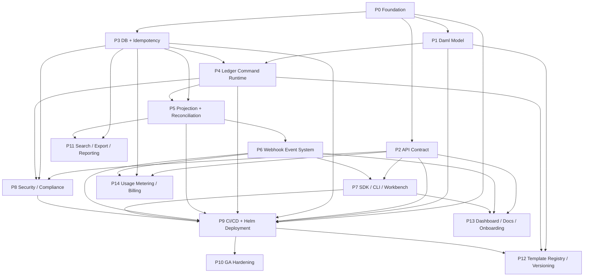

# Pillar Parallelization Plan

> Scheduling map for phase- and ticket-level execution across the Pillar Mission Control plan.

## 1. Phase dependency DAG (with diagram)

This plan treats the Dev phase docs as the source of work definition and this file as the execution scheduler. Phase gates remain authoritative in [README.md](./README.md), invariant checks remain authoritative in [REGRESSION_CONTRACT.md](./REGRESSION_CONTRACT.md), and decisions remain authoritative in [DECISIONS.md](./DECISIONS.md).



| Phase | Mission                          | Primary doc                                                                            | Hard prerequisites | Primary unlock                                             |
| ----- | -------------------------------- | -------------------------------------------------------------------------------------- | ------------------ | ---------------------------------------------------------- |
| P0    | Repository / Toolchain / Sandbox | [Phase_00_Foundation.md](./Phase_00_Foundation.md)                                     | None               | All implementation work                                    |
| P1    | Daml source-of-truth model       | [Phase_01_Daml_Model.md](./Phase_01_Daml_Model.md)                                     | P0                 | Runtime model, template registry                           |
| P2    | API contract and object grammar  | [Phase_02_API_Contract.md](./Phase_02_API_Contract.md)                                 | P0                 | API, SDK, security, billing, dashboard                     |
| P3    | DB schema and idempotency        | [Phase_03_DB_Idempotency.md](./Phase_03_DB_Idempotency.md)                             | P0                 | Runtime persistence, projection substrate, search, billing |
| P4    | Ledger command runtime           | [Phase_04_Ledger_Command_Runtime.md](./Phase_04_Ledger_Command_Runtime.md)             | P1, P3             | Projection and command trace                               |
| P5    | Projection and reconciliation    | [Phase_05_Projection_Reconciliation.md](./Phase_05_Projection_Reconciliation.md)       | P3, P4             | Webhooks, search/export                                    |
| P6    | Webhook-first event system       | [Phase_06_Webhook_Event_System.md](./Phase_06_Webhook_Event_System.md)                 | P5                 | SDK event tooling, onboarding, metering events             |
| P7    | SDK / CLI / Workbench            | [Phase_07_SDK_CLI_Workbench.md](./Phase_07_SDK_CLI_Workbench.md)                       | P2, P6             | Customer integration tooling                               |
| P8    | Security / compliance            | [Phase_08_Security_Compliance.md](./Phase_08_Security_Compliance.md)                   | P2, P3, P4         | Production control readiness                               |
| P9    | CI/CD + Helm deployment          | [Phase_09_CICD_Helm_Deployment.md](./Phase_09_CICD_Helm_Deployment.md)                 | P0..P8             | GA hardening, registry operationalization                  |
| P10   | GA hardening                     | [Phase_10_GA_Hardening.md](./Phase_10_GA_Hardening.md)                                 | P9                 | Release readiness                                          |
| P11   | Search / Export / Reporting      | [Phase_11_Search_Export_Reporting.md](./Phase_11_Search_Export_Reporting.md)           | P3, P5             | Operational/regulator reporting                            |
| P12   | Template Registry / Versioning   | [Phase_12_Template_Registry_Versioning.md](./Phase_12_Template_Registry_Versioning.md) | P1, P4, P9         | DAR lifecycle hardening                                    |
| P13   | Dashboard / Docs / Onboarding    | [Phase_13_Dashboard_Docs_Onboarding.md](./Phase_13_Dashboard_Docs_Onboarding.md)       | P2, P6, P7         | Customer readiness                                         |
| P14   | Usage Metering / Billing         | [Phase_14_Usage_Metering_Billing.md](./Phase_14_Usage_Metering_Billing.md)             | P2, P3, P6         | Commercial readiness                                       |

## 2. Phases that can overlap (with rationale)

| Phase | Scheduling posture       | Required predecessor set | Can overlap with                                | Rationale                                                                                                                                        | Do not start before                      |
| ----- | ------------------------ | ------------------------ | ----------------------------------------------- | ------------------------------------------------------------------------------------------------------------------------------------------------ | ---------------------------------------- |
| P0    | Sequential               | None                     | None                                            | Establishes package managers, JVM/Daml/TypeScript workspaces, compose, and base CI; parallel phase work before P0 creates divergent scaffolding. | N/A                                      |
| P1    | Parallel after P0        | P0                       | P2, P3                                          | Daml template/model work can proceed while API grammar and DB substrate stabilize, provided public objects do not expose Canton internals.       | P0 build gate                            |
| P2    | Parallel after P0        | P0                       | P1, P3, P8 design tracks, P13/P14 design tracks | OpenAPI/object grammar can stabilize independently from Daml implementation; it feeds security, SDK, billing, dashboard, and webhook payloads.   | P0 build gate                            |
| P3    | Parallel after P0        | P0                       | P1, P2                                          | Migration/idempotency substrate can be built while model and API contracts mature; ticket deps still require P2.C04 before P3.D03.               | P0 build gate                            |
| P4    | Dependent                | P1, P3                   | Late P8 control design, P12 registry design     | Command runtime needs Daml artifacts and operation/idempotency tables; implementation cannot safely precede both.                                | P1/P3 exit gates                         |
| P5    | Dependent                | P3, P4                   | P11 design, P8 audit review                     | Projection depends on command/update trace and DB projection tables.                                                                             | P4 command trace gate                    |
| P6    | Dependent                | P5                       | P13/P14 preparation                             | Events must come from projected ledger state, not optimistic API state.                                                                          | P5 projection/event authority gate       |
| P7    | Dependent                | P2, P6                   | P13 onboarding content                          | SDK/CLI/Workbench needs frozen public grammar and webhook/event behavior.                                                                        | P2 public grammar gate and P6 event gate |
| P8    | Parallel-hardening       | P2, P3, P4               | P5/P6 late implementation, P9 preparation       | Security/compliance controls can harden API, DB, and command surfaces before full projection/webhook completion.                                 | P2/P3/P4 security-relevant surfaces      |
| P9    | Integration              | P0..P8                   | P12 implementation preparation                  | CI/CD/Helm must package the integrated system and deployment-mode invariants; it is the main convergence point.                                  | All P0..P8 gates                         |
| P10   | Final GA                 | P9                       | Ongoing P12/P14 hardening                       | Chaos/perf/runbook readiness depends on deployed system; registry and billing can harden alongside if they do not change GA invariants.          | P9 deployment gate                       |
| P11   | Parallel post-projection | P3, P5                   | P6 late, P8 evidence, P13 docs                  | Search/export reads projection/audit/config and can proceed once projection is authoritative and rebuildable.                                    | P5 projection rebuild gate               |
| P12   | Post-deploy registry     | P1, P4, P9               | P10 hardening                                   | Registry needs Daml model, command builder, and Helm/DAR deployment mechanics; it hardens release operations during GA.                          | P9 DAR/Helm gate                         |
| P13   | Customer readiness       | P2, P6, P7               | P10/P14 late hardening                          | Dashboard/docs/onboarding need API, events, and SDK/CLI behavior; can polish during GA readiness.                                                | P7 customer tooling gate                 |
| P14   | Commercial hardening     | P2, P3, P6               | P10/P13                                         | Usage/billing depends on public objects, audit/idempotency DB, and ledger-derived events; can harden through GA.                                 | P6 billable event gate                   |

| Overlap group         | Phases                      | Safe parallel work                                                  | Shared contract                                                                                   | Risk control                                                                  |
| --------------------- | --------------------------- | ------------------------------------------------------------------- | ------------------------------------------------------------------------------------------------- | ----------------------------------------------------------------------------- |
| Foundation fan-out    | P1 + P2 + P3                | Daml model, OpenAPI object grammar, migration/idempotency substrate | Ticket IDs and invariants from [README.md](./README.md)                                           | Daily contract diff on object names, ID prefixes, operation IDs               |
| Runtime convergence   | P4 + P8 design + P12 design | Command runtime, authz/audit controls, template registry shape      | Command trace spine in [REGRESSION_CONTRACT.md](./REGRESSION_CONTRACT.md#5-ledger-trace-contract) | Do not implement registry command selection until P4 package interface exists |
| Projection/event lane | P5 + P6 prep + P11 design   | Projection rebuild, event catalog, search/export field catalog      | Events emitted from projection only                                                               | Search/export jobs cannot source from optimistic API rows                     |
| Customer surface lane | P7 + P13 + P14 design       | SDK/CLI, dashboard, onboarding, usage objects                       | Public `/v1` grammar and event catalog                                                            | No customer docs before SDK examples compile                                  |
| GA lane               | P10 + P12 + P14             | Chaos, perf, DAR lifecycle, billing hardening                       | Deployment-mode invariance from [Architecture 18](../Architecture/18_Deployment.md)               | Freeze public grammar; only operational hardening allowed                     |

## 3. Ticket size buckets (XS,S,M,L,XL definitions in story-point-equivalent or relative effort)

Ticket size is a scheduling and staffing tool, not an acceptance downgrade. A ticket keeps its phase gate regardless of bucket. Split tickets larger than XL before dispatch.

| Bucket | Story-point equivalent | Typical duration proxy                | Shape                                                                                           | Review expectation          | Examples                                                                                         |
| ------ | ---------------------: | ------------------------------------- | ----------------------------------------------------------------------------------------------- | --------------------------- | ------------------------------------------------------------------------------------------------ |
| XS     |                      1 | Same-day narrow change                | Single file or config edit, no new service boundary, no cross-language integration              | Maintainer review only      | Add one OpenAPI example, add one dashboard panel, add one runbook link                           |
| S      |                    2-3 | Small isolated ticket                 | 2-5 files, one package/module, known acceptance command                                         | Area review                 | `P0.A01` workspace creation; a migration index add; one CLI command wrapper                      |
| M      |                      5 | Normal agent-executable ticket        | One subsystem path, tests/golden fixtures, one integration seam                                 | Area + contract review      | API route family, SDK resource group, webhook endpoint CRUD                                      |
| L      |                      8 | Cross-cutting ticket                  | Multiple packages or a correctness-critical invariant, concurrency/idempotency/rebuild behavior | Area + invariant owner      | `P3.D03` idempotency migrations/package; projection rebuild runner; HMAC signer/verifier vectors |
| XL     |                    13+ | Multi-surface harness or system proof | Test harness, performance/chaos suite, or service with deep operational dependencies            | Staff review + gate meeting | `P10.L02` performance harness; full export worker; template upgrade choreography                 |

| Assignment rule                  | Default bucket | Split trigger                                                    | Notes                                                            |
| -------------------------------- | -------------- | ---------------------------------------------------------------- | ---------------------------------------------------------------- |
| Static docs/examples only        | XS/S           | More than one public surface or generated output                 | Keep examples tied to contract snapshots.                        |
| OpenAPI schema + golden fixtures | M              | New object family plus multiple endpoint groups                  | Pair with API matrix checks in [API_MATRIX.md](./API_MATRIX.md). |
| Database migration only          | S/M            | Adds state machine, locking, or replay behavior                  | Any idempotency/rebuild migration moves to L.                    |
| Service internal adapter         | M              | Crosses language boundary or ledger/participant dependency       | Template registry and ledger command adapters are often L.       |
| Customer-facing endpoint family  | M/L            | Requires idempotency, authz, pagination, events, and SDK support | Split route, contract, SDK, docs when needed.                    |
| Invariant proof harness          | L/XL           | Covers chaos, perf, rebuild, or deployment parity                | Keep as gate-owned tickets.                                      |
| Operational runbook              | S/M            | Requires game-day exercise or tooling changes                    | Runbook-only is S; runbook + drill evidence is M/L.              |

| Known ticket                                | Bucket | Reason                                                                           | Scheduling implication                                                            |
| ------------------------------------------- | ------ | -------------------------------------------------------------------------------- | --------------------------------------------------------------------------------- |
| `P0.A01` Create pnpm workspace              | S      | Root package metadata and task graph; important but bounded.                     | First wave, high unblock value.                                                   |
| `P3.D03` Idempotency migrations and package | L      | Locks, canonical request hash, replay/conflict semantics, invariant IC-05/IC-09. | Staff-owned; start immediately after P3.D02 and P2.C04.                           |
| `P10.L02` Performance harness               | XL     | k6, projection lag, webhook fan-out, observability, GA load profile.             | Reserve a dedicated performance owner; start fixture prep before P10 if possible. |
| `P4.F04` Command retry/dedup                | L      | Stable command identity and unique submission identity across failures.          | Must block P5/P10 critical-path promotion.                                        |
| `P5.G06` Projection rebuild runner          | XL     | Rebuild correctness, byte-equal comparison, source-of-truth proof.               | Treat as critical-path proof, not a side task.                                    |
| `P6.H03` Dispatcher e2e                     | L      | Projected event authority, delivery, signing, retry trace.                       | Blocks SDK event tooling and billing event meter.                                 |
| `P9.J04` Deployment-mode parity smoke       | L      | Hosted/customer-validator/self-hosted API parity.                                | Run before P10 and before customer onboarding claims.                             |
| `P12.N*` Registry cutover choreography      | XL     | DAR compatibility, package pins, rollback, Helm job integration.                 | Parallel to P10 only after P9 mechanics exist.                                    |
| `P14.Q*` Usage aggregation                  | L      | Billing correctness over ledger-derived events without double charge.            | Run after P6 event contract is stable.                                            |

For 200+ tickets, bucket during intake with these required metadata fields:

| Field                 | Required value                         | Scheduling use                               |
| --------------------- | -------------------------------------- | -------------------------------------------- |
| `ticket_id`           | `P<phase>.<area><nn>`                  | Dependency resolution and phase gate mapping |
| `bucket`              | XS/S/M/L/XL                            | Capacity planning                            |
| `critical_path`       | yes/no                                 | Release-date sensitivity                     |
| `phase_gate`          | build/verify/invariant/none            | Promotion review owner                       |
| `risk`                | low/medium/high/blocker                | Risk-weighted scheduling                     |
| `primary_path`        | repo path                              | Conflict avoidance                           |
| `deps`                | fully-qualified ticket IDs             | Parallel dispatch graph                      |
| `acceptance_command`  | runnable check or review artifact      | Closure proof                                |
| `owner_pool`          | API/JVM/Daml/SRE/Security/Product/Docs | Resource allocation                          |
| `external_dependency` | dependency ID or none                  | Slack tracking                               |

## 4. Critical path identification

Critical path is governed by source-of-truth, idempotency, projection, event authority, deployment parity, and GA evidence. Customer polish and commercial hardening are important but not allowed to mask a broken ledger-traceable core.

```text
P0.A01/A02/A03/A04
  -> P1 Daml core model
  -> P3.D03 idempotency + P3.D04 operation trace
  -> P4 command builder/retry/completion
  -> P5 projection rebuild/reconciliation
  -> P6 webhook event authority
  -> P8 security/compliance gates
  -> P9 deployment-mode parity
  -> P10 chaos/perf/runbook/readiness
```

| Critical node          | Why it is critical                                               | Primary invariant  | Delay impact                                                       | Acceleration move                                               |
| ---------------------- | ---------------------------------------------------------------- | ------------------ | ------------------------------------------------------------------ | --------------------------------------------------------------- |
| P0 workspace/toolchain | All agents, CI, codegen, and local compose depend on it.         | ADR-0007, ADR-0009 | Blocks every implementation phase.                                 | Staff-owner, no optional tooling, merge early.                  |
| P1 Daml model          | Defines ledger economic source of truth and generated bindings.  | IC-01              | Blocks P4 and P12.                                                 | Start Daml core and test fixtures immediately after P0.         |
| P3.D03 idempotency     | Operation identity and replay safety are foundational.           | IC-05, IC-09       | Blocks safe API mutation, P4 retry semantics, P10 chaos.           | Assign senior DB/runtime owner; review request hash spec early. |
| P3.D04 operation trace | Durable trace spine for support and reconciliation.              | IC-04              | Blocks command trace, projection correlation, compliance evidence. | Pair with P4 trace consumer contract.                           |
| P4 command runtime     | Translates intent to Canton commands and stable command IDs.     | IC-04, IC-05       | Blocks P5, P8 runtime audit, P12 command package adapter.          | Build command envelope before endpoint breadth.                 |
| P5 projection rebuild  | Proves DB is regenerable and powers reads/events.                | IC-02, IC-10       | Blocks P6, P11, GA source-of-truth evidence.                       | Implement rebuild harness before optimization.                  |
| P6 projected events    | Prevents optimistic event emission and enables webhooks/billing. | IC-06, IC-07       | Blocks P7, P13, P14.                                               | Freeze event catalog early and test from projection rows.       |
| P8 compliance controls | Authz, audit, PII, key lifecycle, evidence packets.              | IC-03, IC-08       | Blocks production readiness and enterprise deployment.             | Run threat review against P2/P3/P4 surfaces before P9.          |
| P9 deployment parity   | Proves deployment model changes wiring only.                     | IC-08              | Blocks P10 and registry operationalization.                        | Build smoke matrix before full Helm polish.                     |
| P10 GA readiness       | Final system evidence: chaos, perf, runbooks, sign-off.          | All IC clauses     | Blocks release.                                                    | Reserve performance/SRE capacity before P10 starts.             |

| Non-critical but high-value lane | Can proceed when  | Must not block                                             | Guardrail                                                    |
| -------------------------------- | ----------------- | ---------------------------------------------------------- | ------------------------------------------------------------ |
| P11 search/export                | P3/P5 complete    | P10 release unless regulator export is launch-blocking     | Read projection only; no search-as-truth behavior.           |
| P12 template registry            | P1/P4/P9 complete | P10 core hardening unless DAR lifecycle is launch-blocking | Registry cannot change public `/v1` grammar.                 |
| P13 dashboard/docs/onboarding    | P2/P6/P7 complete | Core ledger correctness                                    | Docs must match generated SDK/API snapshots.                 |
| P14 usage/billing                | P2/P3/P6 complete | Core GA unless billing is launch-blocking                  | Bill from ledger-derived events and audited usage rows only. |

## 5. Wave plan

| Wave   | Phases/tickets in wave                                                                                                              | Blocking exit gate                                                                                                                       | Next wave         |
| ------ | ----------------------------------------------------------------------------------------------------------------------------------- | ---------------------------------------------------------------------------------------------------------------------------------------- | ----------------- |
| Wave 1 | P0 only: workspace, Gradle, Daml, Make targets, CI skeleton, local compose/base Dockerfiles                                         | P0 Build gate: `make bootstrap`, `make daml-build`, `make codegen`, `make test`, local compose config resolve                            | Wave 2            |
| Wave 2 | P1 + P2 + P3 in parallel; prioritize Daml core, OpenAPI object grammar, DB config/audit/idempotency spine                           | Contract convergence gate: P1 core templates compile, P2 forbidden-internals lint/golden pass, P3 idempotency replay/conflict tests pass | Wave 3            |
| Wave 3 | P4 + P5; P8 design/control work starts after P2/P3/P4 surfaces exist; P11 field catalog design may start after P5 schema is visible | Runtime-source gate: stable command_id, command completion trace, projection rebuild proof, reconciliation diff evidence                 | Wave 4            |
| Wave 4 | P6 + P7 + P8; P11 implementation after P5; P13/P14 design tracks after P6 event catalog stabilizes                                  | Customer/control gate: projected events only, HMAC/replay, SDK/CLI generated tests, key/audit controls, compliance leakage scans         | Wave 5            |
| Wave 5 | P9 deployment integration; P11 hardening; P13 implementation; P14 implementation starts after billable event stream is stable       | Deployment gate: Helm/compose deploy, mode parity smoke, migration/DAR/upload mechanics, observability install, no invariant regressions | Wave 6            |
| Wave 6 | P10 + ongoing P12/P14 hardening; P12 registry implementation after P9; P14 billing reconciliation and invoice evidence              | GA gate: chaos, perf, SLO dashboards, alerts, runbooks, security/compliance sign-off, readiness packet                                   | Release candidate |

| Wave   | Team-equivalent focus          | Critical-path tickets                                       | Parallel tickets                                         | Gate owner             |
| ------ | ------------------------------ | ----------------------------------------------------------- | -------------------------------------------------------- | ---------------------- |
| Wave 1 | Platform foundation            | `P0.A01`, `P0.A02`, `P0.A03`, `P0.A04`                      | `P0.A05`, `P0.J01`, `P0.J02`, `P0.J03`                   | Platform lead          |
| Wave 2 | Daml/API/DB split              | P1 core model, P2 object grammar, `P3.D03`, `P3.D04`        | Examples, codegen, basic migrations, API golden fixtures | Architecture + DB lead |
| Wave 3 | Runtime/projection             | P4 command identity, P5 rebuild/reconciliation              | P8 audit design, P11 API design                          | Runtime lead           |
| Wave 4 | Events/customer/security       | `P6.H02`, `P6.H03`, P7 generated SDK, P8 key/authz controls | P13 docs shell, P14 usage model                          | Security + API lead    |
| Wave 5 | Deployment/customer/commercial | P9 parity, migration deploy, observability install          | P11 export jobs, P13 onboarding, P14 metering worker     | SRE lead               |
| Wave 6 | GA evidence                    | `P10.L01`, `P10.L02`, `P10.L05`, `P10.L08`                  | P12 registry, P14 billing reconciliation                 | Release captain        |

## 6. Resource pool assumptions

| Pool                   | Skills                                                               | Primary phases       | Single-team allocation                           | Multi-team allocation                                | Constraints                                                         |
| ---------------------- | -------------------------------------------------------------------- | -------------------- | ------------------------------------------------ | ---------------------------------------------------- | ------------------------------------------------------------------- |
| Platform/SRE           | CI, Docker, Helm, observability, release                             | P0, P9, P10, P12     | 1 owner throughout; bursts at P9/P10             | Dedicated P0/P9/P10 team                             | Avoid owning feature code and release gates simultaneously.         |
| Daml/Canton JVM        | Daml, Ledger API, command submission, projection                     | P1, P4, P5, P12      | 1-2 senior engineers on critical path            | Split Daml model, command runtime, projection teams  | Command identity and projection trace need shared design review.    |
| API/TypeScript         | OpenAPI, Fastify, SDK generation, CLI                                | P2, P6, P7, P13, P14 | 1 API owner plus SDK support                     | Separate API contract and customer tooling teams     | Public grammar freeze must precede SDK/customer docs.               |
| DB/Data                | Postgres migrations, idempotency, search/export, billing aggregation | P3, P5, P11, P14     | 1 DB owner owns migrations and idempotency       | Separate idempotency/projection/search/billing lanes | Migration ranges must not overlap.                                  |
| Security/Compliance    | Authn/authz, audit, PII, KYC, evidence                               | P8, P10, P11, P14    | Reviewer lane during P2-P6; implementation at P8 | Dedicated security team from Wave 3                  | Security controls must not be bolted on after P9.                   |
| Product/Docs/Workbench | Onboarding, dashboard, examples, docs site                           | P7, P13              | Starts after API/event stability                 | Dedicated customer-readiness team                    | Docs/examples must be generated or verified against actual SDK/API. |

| Execution mode                  | Recommended use                           | Pros                                                              | Risks                                        | Required control                                        |
| ------------------------------- | ----------------------------------------- | ----------------------------------------------------------------- | -------------------------------------------- | ------------------------------------------------------- |
| Single-team sequential core     | Small team, pre-funding, high uncertainty | Low coordination cost, strong shared context                      | Critical path takes longer; specialists idle | Aggressive ticket splitting and early risk spikes       |
| Two-team core split             | Normal default                            | Daml/JVM/DB lane plus API/customer lane                           | API/runtime contract drift                   | Weekly contract review and generated snapshot diff      |
| Three-team scale-out            | Wave 3 onward                             | Runtime/projection, API/events/customer, SRE/security in parallel | Gate ownership ambiguity                     | Named gate owners and one release captain               |
| Multi-team with governance lane | Enterprise push                           | Keeps P8/P9/P10 evidence current                                  | Review bottlenecks                           | Pre-scheduled promotion reviews and metadata discipline |

| Wave   | Minimum team-equivalents | Comfortable team-equivalents | Notes                                                                  |
| ------ | -----------------------: | ---------------------------: | ---------------------------------------------------------------------- |
| Wave 1 |                        2 |                            3 | Platform + Daml/JVM bootstrap + API workspace review.                  |
| Wave 2 |                        4 |                            6 | Daml, API, DB, reviewer; add security reviewer if available.           |
| Wave 3 |                        5 |                            8 | Command runtime, projection, DB, SRE, security; high integration load. |
| Wave 4 |                        5 |                            9 | Events, SDK, security, customer docs, billing design.                  |
| Wave 5 |                        6 |                           10 | Deployment, observability, customer onboarding, export/billing.        |
| Wave 6 |                        6 |                           10 | GA evidence, perf/chaos, runbooks, registry, billing reconciliation.   |

## 7. External dependencies and their slack

| External dependency   | Consuming phases             | Needed by                                                      | Slack window                                                                                                        | Early action                                                                                          | If delayed                                                                                       |
| --------------------- | ---------------------------- | -------------------------------------------------------------- | ------------------------------------------------------------------------------------------------------------------- | ----------------------------------------------------------------------------------------------------- | ------------------------------------------------------------------------------------------------ |
| Canton release        | P0, P1, P4, P5, P9, P10, P12 | P1 Daml compile and P4/P5 runtime correctness                  | Short: pin before P0 toolchain freeze; re-pin only through ADR/release decision                                     | Select SDK/Canton version during P0; validate sandbox, codegen, Ledger API, PQS behavior              | Freeze on last validated version; defer upgrade to P12/P10 hardening lane                        |
| DPM release           | P0, P1, P9, P12              | Daml package build, DAR artifact, registry ingest              | Short: must be stable before P1 templates and P9 DAR job                                                            | Pin DPM in P0; record checksum and build command; test multi-package workspace                        | Use pinned prior release; block template registry upgrade features that require new DPM behavior |
| KYC vendor onboarding | P8, P13, P14                 | Compliance flows, onboarding screens, billed compliance events | Medium: mock-free contract design can proceed; live integration blocks production launch for KYC-required customers | Start vendor legal/API onboarding by Wave 2; define adapter boundary and evidence fields in P8        | Ship non-KYC sandbox/demo only; mark production compliance gate red for KYC-required assets      |
| Billing account        | P14, P13                     | Billing payment collection, invoices, customer account ops     | Medium: metering can proceed from usage events before live billing credentials                                       | Create test and live account early; define restricted keys, webhook endpoint, billing product catalog | Keep usage ledger and invoice preview internal; block external billing collection                |
| cosign/SLSA tooling   | P9, P10, P12                 | Image/chart/DAR signing, provenance, release packet            | Medium-short: must be ready before P9 release automation and P10 readiness                                          | Choose keyless/keyed signing mode in Wave 2; integrate in CI skeleton before P9                       | Do not promote release candidate; unsigned artifacts fail GA readiness                           |

| Dependency            | Tracking field                             | Owner pool               | Review cadence                    | Gate affected                 |
| --------------------- | ------------------------------------------ | ------------------------ | --------------------------------- | ----------------------------- |
| Canton release        | `external_dependency=CANTON_RELEASE`       | Daml/Canton JVM          | Each phase promotion P0-P5/P9/P10 | Build, Verify                 |
| DPM release           | `external_dependency=DPM_RELEASE`          | Platform + Daml          | P0, P1, P9, P12 gates             | Build, Verify                 |
| KYC vendor onboarding | `external_dependency=KYC_VENDOR`           | Security/Compliance      | Wave 2 onward                     | Security/Compliance readiness |
| Billing account        | `external_dependency=BILLING_ACCOUNT`       | Product/Billing/Security | Wave 4 onward                     | P14 verify, P13 onboarding    |
| cosign/SLSA tooling   | `external_dependency=SUPPLY_CHAIN_SIGNING` | Platform/SRE/Security    | Wave 2 onward                     | P9/P10 release gate           |

## 8. Risk-weighted scheduling adjustments

| Risk                                      | Affected phases      | Scheduling adjustment                                                                                                  | Reason                                                                     | Escalation trigger                                                     |
| ----------------------------------------- | -------------------- | ---------------------------------------------------------------------------------------------------------------------- | -------------------------------------------------------------------------- | ---------------------------------------------------------------------- |
| Idempotency or command identity ambiguity | P3, P4, P10          | Pull `P3.D03`, `P3.D04`, P4 command identity tickets to earliest possible slots; staff-review before breadth endpoints | Duplicate economic operation is catastrophic.                              | Any replay/conflict test instability or changed command_id derivation. |
| Projection rebuild uncertainty            | P5, P6, P11, P10     | Build rebuild harness before API read optimizations and before search/export                                           | DB must stay Projection/Audit/Config only.                                 | Rebuild output differs without explainable ledger input change.        |
| Webhook optimistic emission               | P6, P7, P14          | Block dispatcher e2e until event source is projected state; meter only from event log after projection                 | Webhook/billing must not observe uncommitted state.                        | Event emitted without projection offset/watermark.                     |
| Deployment-mode API drift                 | P2, P7, P9, P10, P13 | Add API diff across hosted/customer-validator/self-hosted in P9 and repeat in P10                                      | Deployment model changes wiring only.                                      | Any OpenAPI/golden/SDK diff by deployment mode.                        |
| Supply-chain signing late                 | P9, P10, P12         | Start cosign/SLSA proof in Wave 2 even though P9 owns release automation                                               | Release provenance late integration can block GA.                          | Unsigned image/chart/DAR reaches release candidate.                    |
| KYC/vendor uncertainty                    | P8, P13, P14         | Treat vendor live credentials as external-dependency gate; keep adapter boundary and evidence schema vendor-neutral    | Avoid coupling core ledger flow to vendor onboarding.                      | Production KYC-required asset without vendor evidence path.            |
| Performance unknowns                      | P5, P6, P10, P11     | Create synthetic load fixtures before P10; size `P10.L02` XL with dedicated owner                                      | Perf harness cannot be bolted on in final week.                            | Projection/webhook p99 targets miss under nominal load.                |
| DAR lifecycle operational gap             | P9, P12, P10         | Convert P9 DAR upload to registry-driven path in P12; rehearse rollback before GA readiness                            | Package selection drift can break command builders.                        | Command builder can select package absent from active registry.        |
| Billing double-counting                   | P14, P6, P3          | Delay invoice finalization until event idempotency and usage aggregation are proven                                    | Billing from retries or duplicate webhooks creates customer trust failure. | Same ledger-derived event can create multiple billable usage records.  |

| Adjustment                             | Concrete action                                                                   | Applies to    | Expected effect                                |
| -------------------------------------- | --------------------------------------------------------------------------------- | ------------- | ---------------------------------------------- |
| Front-load invariants                  | Schedule IC-04/IC-05/IC-10 tickets before endpoint breadth.                       | P3/P4/P5      | Reduces late architectural rewrites.           |
| Staff own XL gates                     | Assign senior owner to `P5.G06`, `P10.L01`, `P10.L02`, P12 registry choreography. | P5/P10/P12    | Keeps release proof credible.                  |
| Freeze public grammar early            | Lock P2 OpenAPI/golden snapshots before SDK, dashboard, billing.                  | P2/P7/P13/P14 | Prevents fan-out churn.                        |
| Run security review before P9          | P8 reviews API/DB/runtime before Helm packaging.                                  | P8/P9         | Avoids reworking deployment artifacts.         |
| Keep customer polish off critical path | P13 runs parallel after P7, but cannot change API grammar.                        | P13           | Protects core correctness.                     |
| Maintain external dependency slack     | Track Canton/DPM/KYC/billing/signing as metadata, not informal notes.              | All waves     | Makes blocked tickets visible before gate day. |

## 9. Tooling required to track this

The local `todo_write` board is acceptable for one-agent execution, but multi-team execution needs an external issue tracker with dependency graph, custom fields, dashboards, and promotion reports. The source of truth for ticket definitions remains `docs/Dev/Phase_*.md`; the tracker mirrors state and evidence.

| Tooling need              | Minimum local tool                            | External tracker requirement                       | Why                                         |
| ------------------------- | --------------------------------------------- | -------------------------------------------------- | ------------------------------------------- |
| Ticket inventory          | `todo_write` entries copied from phase tables | Issues generated from phase ticket IDs             | Avoids orphan work and duplicate IDs.       |
| Dependency graph          | Manual checklist                              | Graph view over `deps` field                       | Enables safe parallel dispatch.             |
| Size/capacity             | Bucket label                                  | XS/S/M/L/XL custom field                           | Plans 200+ tickets across teams.            |
| Gate status               | Todo notes                                    | Build/Verify/Invariant gate fields                 | Promotion meetings need objective evidence. |
| Evidence links            | File paths in todo                            | Artifact URL fields for logs, screenshots, reports | Reviewers need reproducible proof.          |
| External dependency slack | Comment thread                                | Dependency object with owner/date/status           | Prevents vendor/tooling surprise blocks.    |
| Risk management           | Risk label                                    | Risk score + mitigation owner                      | High-risk tickets get pulled forward.       |
| Release readiness         | Manual checklist                              | Milestone dashboard by wave and gate               | P10 readiness packet assembly.              |

| Metadata field        | Type      | Required | Example                                             |
| --------------------- | --------- | -------- | --------------------------------------------------- |
| `ticket_id`           | string    | Yes      | `P3.D03`                                            |
| `title`               | string    | Yes      | `Idempotency migrations and package`                |
| `phase`               | enum      | Yes      | `P3`                                                |
| `area`                | enum      | Yes      | `D`                                                 |
| `bucket`              | enum      | Yes      | `L`                                                 |
| `deps`                | list      | Yes      | `P3.D02, P2.C04`                                    |
| `primary_path`        | path      | Yes      | `packages/idempotency`                              |
| `acceptance`          | string    | Yes      | `Same key/hash replays; different hash returns 409` |
| `gate`                | enum      | Yes      | `Invariant`                                         |
| `risk`                | enum      | Yes      | `high`                                              |
| `owner_pool`          | enum      | Yes      | `DB/Data`                                           |
| `critical_path`       | boolean   | Yes      | `true`                                              |
| `external_dependency` | enum/list | No       | `CANTON_RELEASE`                                    |
| `evidence_url`        | URL/path  | At close | CI run, report, artifact, doc link                  |
| `promotion_state`     | enum      | Yes      | `not-started / in-progress / review / green / red`  |

| Dashboard                 | Filters                                         | Audience                     | Decision supported                         |
| ------------------------- | ----------------------------------------------- | ---------------------------- | ------------------------------------------ |
| Critical path             | `critical_path=true AND promotion_state!=green` | Release captain, staff leads | What can delay GA.                         |
| Wave readiness            | `wave=current AND blockers>0`                   | All leads                    | Whether the next wave can start.           |
| External dependency slack | `external_dependency!=none`                     | Program owner                | Vendor/tooling escalation.                 |
| Gate failures             | `promotion_state=red` grouped by gate           | Phase owners                 | Build vs Verify vs Invariant fixes.        |
| XL tickets                | `bucket=XL`                                     | Staff reviewers              | Early design and proof allocation.         |
| Path collision            | Same `primary_path` active across tickets       | Engineering managers         | Avoid merge conflicts and duplicated work. |

## 10. Promotion gate review meetings

Promotion reviews are short, evidence-driven, and tied to gate artifacts. A phase does not promote because tickets are closed; it promotes when Build, Verify, and Invariant gates are green.

| Meeting                           | Trigger                                         | Required attendees                                             | Inputs                                                             | Output                                                                |
| --------------------------------- | ----------------------------------------------- | -------------------------------------------------------------- | ------------------------------------------------------------------ | --------------------------------------------------------------------- |
| Wave kickoff                      | Prior wave gate green or approved overlap start | Phase owners, release captain, security reviewer when relevant | Wave table, dependency graph, open external dependencies           | Confirm owner pools and critical tickets.                             |
| Contract convergence review       | P1/P2/P3 mid-wave                               | Daml, API, DB, security                                        | Object grammar, ID prefixes, idempotency spec, Daml model notes    | Freeze shared interfaces or file blocking deltas.                     |
| Runtime trace review              | P4 before P5 promotion                          | Runtime, DB, projection, security                              | Command identity tests, operation trace evidence                   | Approve projection/event consumers.                                   |
| Projection authority review       | P5 before P6/P11 promotion                      | Projection, API, webhook, SRE                                  | Rebuild output, reconciliation diffs, event-source proof           | Authorize webhook/search consumption.                                 |
| Security/compliance review        | P8 before P9                                    | Security, compliance, API, runtime, SRE                        | Threat model, audit evidence, leakage scans, key lifecycle tests   | Approve packaging for deployable environments.                        |
| Deployment parity review          | P9 before P10                                   | SRE, API, runtime, security                                    | Helm/compose results, deployment-mode API diff, migration evidence | Approve GA hardening.                                                 |
| GA readiness review               | `P10.L08`                                       | Release captain, staff leads, SRE, security, product           | Chaos, perf, SLO, alerts, runbooks, compliance sign-offs           | Release candidate go/no-go.                                           |
| Registry/billing hardening review | During Wave 6                                   | Runtime, SRE, billing, security                                | P12 DAR lifecycle evidence, P14 usage reconciliation               | Decide whether registry/billing are GA-blocking or post-GA hardening. |

| Gate                | Evidence required                                                                               | Reviewer decision            | Failure handling                                                  |
| ------------------- | ----------------------------------------------------------------------------------------------- | ---------------------------- | ----------------------------------------------------------------- |
| Build               | Commands from [README.md §3](./README.md#3-gate-model), phase-specific build checks             | Green/red only               | Open fix ticket in same phase; do not promote.                    |
| Verify              | Phase acceptance commands, golden snapshots, e2e, chaos/perf reports                            | Green/red with evidence link | Fix at source; no suppression or waived tests.                    |
| Invariant           | [REGRESSION_CONTRACT.md](./REGRESSION_CONTRACT.md) clause review and forbidden-regression scans | Green/red by invariant owner | Block promotion until invariant is restored.                      |
| External dependency | Dependency status and fallback posture                                                          | Cleared/blocked/deferred     | If production capability depends on it, mark phase gate red.      |
| Release readiness   | Signed packet, artifact provenance, SLO/runbook evidence                                        | Go/no-go                     | No release candidate with unsigned artifacts or missing runbooks. |

| Promotion rule            | Practical interpretation                                                         |
| ------------------------- | -------------------------------------------------------------------------------- |
| P0 is always first        | No phase starts implementation before P0 workspace/toolchain is usable.          |
| P1/P2/P3 overlap after P0 | Use contract reviews to prevent Daml/API/DB drift.                               |
| P4 waits for P1/P3        | Command runtime needs Daml bindings and operation/idempotency tables.            |
| P5 waits for P3/P4        | Projection must correlate ledger updates with operation trace.                   |
| P6 waits for P5           | Webhooks must be projection-derived.                                             |
| P7 waits for P2/P6        | SDK/CLI/Workbench must reflect stable API and events.                            |
| P8 waits for P2/P3/P4     | Security controls need real API, DB, and command surfaces.                       |
| P9 waits for P0..P8       | Deployment packages the integrated system, not partial scaffolds.                |
| P10 waits for P9          | GA evidence must run against deployable artifacts.                               |
| P11 waits for P3/P5       | Search/export read projection and audit/config only.                             |
| P12 waits for P1/P4/P9    | Registry requires Daml package model, command builder, and deployment mechanics. |
| P13 waits for P2/P6/P7    | Customer onboarding must match real API/event/SDK behavior.                      |
| P14 waits for P2/P3/P6    | Billing uses public objects, audit/idempotency substrate, and projected events.  |
